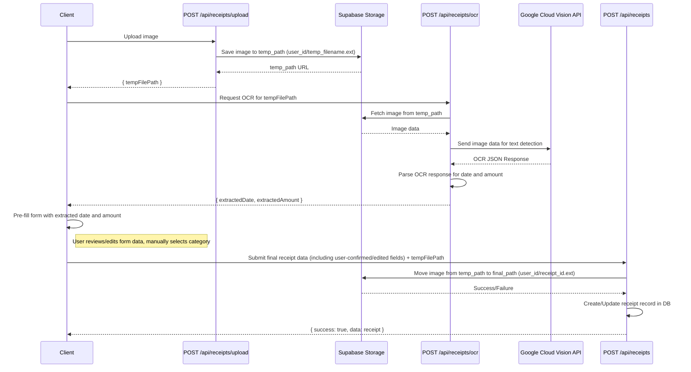

# OCR Autofill Integration Plan (Simplified)

**Overall Goal:** To automatically extract `receipt_date` and `amount` from uploaded receipt images using Google Cloud Vision API. These values will pre-fill the receipt submission form for user review and confirmation. The `category` will be manually selected by the user.

## Phase 1: Backend Setup & OCR API Implementation

1.  **Google Cloud Vision API Setup:**
    *   Ensure a Google Cloud Project is set up.
    *   Enable the Cloud Vision API for the project.
    *   Create a service account with appropriate permissions for the Vision API.
    *   Download the JSON key for the service account.
    *   Store the service account key credentials securely (e.g., as a Vercel environment variable, loaded by the backend).
    *   Add necessary environment variables to the project.

2.  **New API Route for OCR Processing (`dws-app/src/app/api/receipts/ocr/route.ts`):**
    *   This endpoint will:
        *   Accept a `tempFilePath` (path to the image in Supabase temporary storage) as input.
        *   Retrieve the image file from Supabase Storage using the `tempFilePath`.
        *   Send the image content to the Google Cloud Vision API (using the Node.js client library), focusing on `TEXT_DETECTION` or `DOCUMENT_TEXT_DETECTION`.
        *   Parse the Vision API's JSON response.
        *   Implement logic to extract:
            *   **Receipt Date:** Search for common date patterns (e.g., YYYY-MM-DD, MM/DD/YYYY, DD Mon YYYY) using regular expressions or leverage any structured date information from the API.
            *   **Amount:** Search for keywords like "Total", "Amount", "Balance Due" and associated numerical values. Consider currency symbols.
        *   Return the extracted `date` and `amount` (or null/undefined if not found).
    *   Ensure this API route is authenticated, similar to other API routes in the project.

## Phase 2: Frontend Integration

1.  **Modify Receipt Uploader Component (`dws-app/src/components/receipt-uploader.tsx`):**
    *   After successfully uploading the image in Phase 1 of the existing workflow (image sent to `POST /api/receipts/upload` and `tempFilePath` received), make a new API call from the client to the new `/api/receipts/ocr` endpoint, sending the `tempFilePath`.
    *   Handle the response from the OCR API:
        *   On success, store the extracted `date` and `amount` in the component's state.
        *   On failure or if data isn't found, prepare to show empty or default values in the form.
    *   Pass the extracted data (or defaults) to the receipt submission form.

2.  **Update Receipt Submission Form (likely within `dws-app/src/components/receipt-uploader.tsx` or a modal it invokes):**
    *   Pre-fill the `receipt_date` and `amount` fields with the data received from the OCR API.
    *   The `category` selection will remain a manual process for the user.
    *   Ensure users can easily review and edit these pre-filled values. The fields should behave like regular input fields once pre-filled.

## Phase 3: Workflow Adjustment (Simplified Diagram)

## Phase 4: Error Handling and UX Refinements

*   **OCR API Errors:** If the `/api/receipts/ocr` call fails or Google Vision API returns an error, the frontend should gracefully handle this by not pre-filling fields and possibly showing a subtle notification that autofill couldn't be performed. The form should still be usable for manual entry.
*   **No Data Found:** If specific fields (e.g., date or amount) aren't found by the OCR logic, those form fields will simply remain empty for manual input.
*   **Loading States:** Implement loading indicators on the frontend while the OCR processing is in progress after image upload.

## Phase 5: Testing

*   Test with various receipt types, image qualities, and formats (JPG, PNG, PDF).
*   Verify accuracy of extracted date and amount.
*   Test error handling and fallback to manual entry.