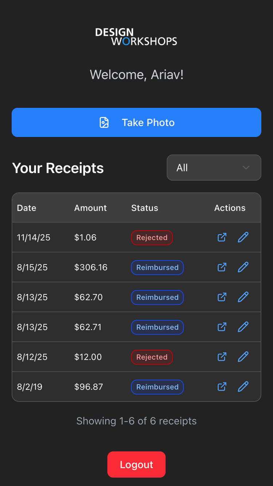

# Employee Features

[[README|← Back to Index]]

## Overview

Employees access `/employee` to submit receipts via mobile-first interface with camera integration and OCR auto-fill.



## Receipt Submission Flow

### 1. Capture/Upload

**Mobile**: "Take Photo" button triggers native camera or photo library

**Desktop**: "Upload Receipt" button opens file picker

**Supported formats**: JPEG, PNG, WebP, HEIC, PDF

### 2. File Processing

```
Selected → Validated → Uploaded to temp → OCR called
```

Size limits:
- Mobile: 50 MB
- Desktop: 10 MB

### 3. OCR Auto-Fill

AI extracts:
- **Date**: Purchase date in YYYY-MM-DD format
- **Amount**: Total including tax/tip
- **Category**: Parking, Gas, Meals & Entertainment, Office Supplies, Other

### 4. Auto-Submit Decision

If ALL conditions met:
- ✅ Date extracted
- ✅ Amount extracted
- ✅ Category resolved to ID
- ✅ No duplicate found

→ Auto-submits with success toast (includes "Tap to edit" link)

Otherwise → Opens confirmation form for manual entry.

### 5. Manual Confirmation

User reviews and can edit:
- Date (native date picker on mobile, calendar on desktop)
- Amount
- Category (dropdown)
- Notes/Description


Duplicate warning if matching date+amount exists.

## Mobile-First Design

### Platform Detection

```typescript
// Combines screen size + user agent
const isMobile = window.innerWidth < 768 || /iPhone|iPad|Android/.test(userAgent);
```

### Camera Integration

Mobile file input includes HEIC for iOS:
```html
<input type="file" accept="image/heic,image/jpeg,image/png,..." />
```

### Responsive Components

| Component | Mobile | Desktop |
|-----------|--------|---------|
| Receipt form | Bottom drawer | Center dialog |
| Date picker | Native `<input type="date">` | Calendar popover |
| Table text | text-xs | text-sm |
| Icons | 14px | 16px |

### Contextual Feedback

Distinguishes camera capture vs file selection:
- "Photo captured successfully" - recent file (< 30 sec) with camera name pattern
- "File selected successfully" - older file

## Receipt Table

### Columns

| Column | Mobile | Desktop |
|--------|--------|---------|
| Date | M/D/YY | Full date |
| Amount | $XX.XX | $XX.XX |
| Status | Badge | Badge |
| Actions | View, Edit | View, Edit |

### Status Badges

| Status | Color |
|--------|-------|
| Pending | Yellow |
| Approved | Green |
| Rejected | Red |
| Reimbursed | Blue |

### Filtering

Dropdown with options: All, Pending, Approved, Rejected, Reimbursed

### Pagination

- 10 items per page
- Smart ellipsis (shows first, last, current ± 1)

## Edit Restrictions

Employees can only edit **their own pending** receipts.

Attempting to edit processed receipt shows:
> "This receipt has been [status]. Please contact a system administrator."

## Key Files

| File | Purpose |
|------|---------|
| `app/employee/page.tsx` | Employee portal |
| `components/receipt-uploader.tsx` | Upload + OCR flow |
| `components/employee-receipt-table.tsx` | Receipt list |
| `components/receipt-details-card.tsx` | Edit form |
| `hooks/use-mobile.tsx` | Mobile detection |
| `lib/phone.ts` | Phone formatting |

## Error Handling

### Upload Errors

- File too large → Toast with size limit
- Invalid type → Platform-specific guidance (camera/library vs camera/gallery)
- Upload failed → Shows error, clears state

### OCR Errors

- Extraction fails → Opens form for manual entry
- Partial extraction → Shows form with available fields pre-filled

### Edit Errors

- Update failed → Toast with error message
- 403 error → Shows "Contact Admin" dialog

## Duplicate Detection

On form submit:
1. Checks for existing receipt with same date + amount
2. If found, compares notes/description
3. If description matches or both empty → Blocks with warning
4. If description differs → Allows submission

## Profile Auto-Creation

First login without profile creates default:

```typescript
{
  user_id: session.user.id,
  role: 'employee',
  full_name: session.user.phone  // Placeholder
}
```

## Related Pages

- [[Receipts]] - Upload and OCR details
- [[Authentication]] - Login flow
- [[API]] - Endpoint reference
- [[Components]] - UI components used
