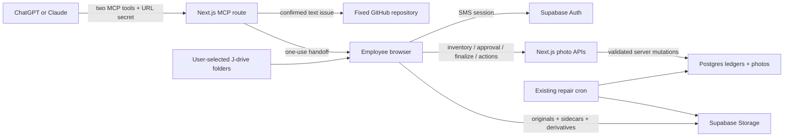

# Hosted DWS MCP, photo migration, and issue reporting

This technical specification and implementation plan changes live photo authorization, library identity, deletion, uploads, and repair. Deliver it in one PR through sequential, independently verified phases, followed by an operator-controlled production cutover.

**Agent brief.** Intent: deliver both `photos` and `report_issue` through two hosted MCP tools in the existing Next.js application. Source of truth: this plan, then the frozen [System Design](sources/system-design.md), [research](sources/research.md), and [ticket](sources/ticket.md). This plan replaces the remaining separate Program Design interview. The user subsequently requested a Claude review and incorporation of its findings; the [review dispositions](journal.md) record those changes. Locked decisions: direct browser-to-Supabase uploads, shared secret-bearing MCP URL, SMS identity for photo actions, full photo authority through a valid handoff, ordinary deletion (first uploader-or-admin; opened to any signed-in employee on 2026-09-20 by `plans/active/photo-albums/plan.md` Decision 7), global hashed content identity, and 30-day trash. Current phase: **issue-interview revision and local implementation verified; external office/activation checks outstanding**; preflight passed on 2026-09-07. Stop-and-ask triggers: a need to change those decisions, provision another runtime, remove a must-ship skill, automatically choose production canonical photos, or make trash private by changing the bucket model. Dependency/API adaptation, test failures, and ordinary code organization remain implementation-owned.

The user-requested [planning contract](sources/planning-contract/AGENTS.md), [authoring reference](sources/planning-contract/refs/authoring.md), and [implementation discipline](sources/planning-contract/IMPLEMENTATION.md) are frozen alongside this plan for portability. Their demo-only tooling and cross-repository paths are reference context, not commands or missing prerequisites for OpenReimbursements; this plan supplies the applicable execution and verification entry points. Every build phase runs continuously to its exit criteria; there are no recurring phase-approval gates. Production mutations remain subject to the explicit cutover actions below.

## Why and scope

The hosted assistant cannot read the office `J:` drive. The existing upload engine can move bytes directly to Storage, but its browser-local queue cannot reliably inventory, resume, or explain a many-folder migration. Add a durable control plane around that engine, plus confirmed photo administration and a small issue-reporting path. Doing nothing leaves large migrations dependent on short-lived browser state and offers no hosted assistant entry point.

The PR is feasible as one delivery unit because it extends the existing upload/auth/repair application and ships one complete MCP registry. It is substantial: correctness rests on coordinated database, route, browser, and repair changes. Phase completion is not permission to deploy a partial registry or incompatible schema. Splitting the PR is a reversible delivery choice if reviewability becomes poor; it does not reduce the must-ship release scope.

Keep one implementation PR with phase-sized commits and their Verify evidence. The dependency chain is linear, Phase 1 → 2 → 3 → 4 → 5 → 6 → 7. Phase 1 establishes the load-bearing database authority contract; its harness setup is required scaffolding. Phases 2–6 establish the upload, recovery, administration, retention, and MCP contracts. Phase 7 proves integration and owns production activation. Scrutiny is highest on Phases 1, 2, 4, 5, and 7 because errors there can alter durable identity, permissions, or retained objects. At every phase entry, apply the common inventory/anchor recipe and require the previous phase's exit evidence. Phases 1–6 are **verified**; Phase 7’s implementation and isolated checks are **verified**, while its external office/activation checks remain open. The user authorized consecutive execution with Astra High implementation agents and independent Astra Low verification, plus local reviews and PR shipping; the main thread owns plan changes and acceptance. Production activation evidence remains subject to the concrete operator obligations below.

Goals are to admit each migrated file immediately and at most once by known digest, recover unfinished work after ordinary interruptions, make photo changes attributable and recoverable, and return a GitHub issue URL only when publication is known. Non-goals chosen during the interview: OAuth, a second Vercel project, server access to local shares, background uploads after the browser closes, immutable approval snapshots, multiple simultaneous owning jobs, Picasa albums/faces/edit recipes, screenshot intake, similar-issue search, repository diagnosis, and coding-agent launches. Future Help Desk design has no owning artifact yet and is outside this plan.

## System sketch



`dws-app` is the repository application directory. Research identifies its existing production Vercel project as `dws-receipts`; revalidate that identity before deployment rather than creating a project named `dws-app`. Both domains attach to that existing project. Supabase Pro retains Auth, Postgres, and the public `photos` bucket. The last observed object limit is 50 GiB; 100+ GB describes an aggregate corpus.

## Premise anchors and execution scope

Recheck the relevant anchor at every phase entry. A changed implementation detail updates the recipe; a changed authority, storage topology, or deployment premise requires re-planning before dependent work.

| Anchor | Revalidation probe from repository root |
|---|---|
| Current source baseline | `git rev-parse HEAD`; compare changes since `142b09c80977c25206ff6883294aa54326efb0d5` in the touched domain |
| Existing TUS and finalization engine | `rg -n 'createResumableUpload|uploadOne|exists|finalize' dws-app/src/lib/photos/upload.ts dws-app/src/lib/photos/upload-tus.ts dws-app/src/lib/photos/upload-manager.tsx` |
| Uploader-or-admin deletion (true when written; removed 2026-09-20 by `plans/active/photo-albums/plan.md` Decision 7) and direct organizational grants | `cat dws-app/supabase/migrations/20260822130100_rls_photos_tighten_update.sql`; read current `dws-app/src/app/api/photos/[id]/route.ts` |
| Repair is one 300-second function | `rg -n 'maxDuration|BUDGET|planSweep|deleteDeadRow' dws-app/src/app/api/photos/repair/route.ts`; read `dws-app/vercel.json` |
| Build does not enforce TypeScript success | `cat dws-app/next.config.ts dws-app/package.json dws-app/vitest.config.ts` |
| Production identity and bucket configuration | Read-only `vercel project inspect dws-receipts`; authenticated read of the linked Storage bucket; compare project and aliases with the research follow-up |

Derived implementation inventory, run at each phase entry: use `rg --files dws-app/src dws-app/supabase dws-app/scripts Docs`, then `rg -n 'photos|photo_content|migration|dws_action|report_issue|get_photo_job_summaries|get_photo_tags'` within those roots. For photo schema/read changes, additionally locate every `.from('photos')`, `.from("photos")`, SQL reference to `public.photos`, and consumer of the two RPCs. Classify every hit as active-library read, intentional trash/dedupe/ownership read, mutation, or test. Completeness means every production hit has a declared category and obeys that category's rule; a default read with no category fails the audit. These recipes replace a stale per-file worklist.

## Contract surface

### Two MCP tools dispatch six allowlisted scripts

**Harness revision (2026-09-08, user steering):** MCP delivers the DWS harness through progressive skill loading. Shared AGENTS-style guidance is returned through the standard initialization `instructions` field. `load_dws_skill` advertises skill names and implicit-invocation descriptions written around employee intent; that description is generated from the same skill metadata used when loading a skill. `execute_dws_script` is a generic executor: neither its description nor its discovery schema enumerates the operation catalog. Loaded skills supply their workflows, script descriptions and complete argument schemas. The server continues to enforce the fixed implementation allowlist and exact per-script validation; generic discovery does not enable arbitrary execution.

Keep the shared guidance and each skill body in dedicated Markdown files, with each skill's name and invocation description in its frontmatter. Preserve the current photo authority, confirmation, retention, and issue-publication rules in those bodies. Adding an implemented skill updates its metadata and explicit registry binding rather than another manually maintained tool description. Tool loading also returns the shared guidance as a fallback: MCP clients may choose how to include initialization instructions in model context, so provider-independent delivery is observable but universal client injection is not assumed. Ensure the Markdown ships in the deployed Next function and capture the actual initialization, discovery and skill-load payloads as verification evidence.

```ts
load_dws_skill({ skill_name: "photos" | "report_issue" })
execute_dws_script({ script_name, input })

type PhotoReference =
  | { photo_id: string }
  | { photo_url: string }  // app URL /photos?photo=<photo-id>, or the older /photos/<job-id>?photo=<photo-id>; both accepted on the new and old photo hosts since 2026-09-20 (photo-albums § URLs)
  | { job_number: string; original_filename: string };
type PhotoSelector =
  | { photos: PhotoReference[] }
  | { job_number: string; scope: "active" | "trash" };

migrate_photos({ sources?: { label: string; job_number?: string }[] })
add_photos({ job_number?: string; tags?: string[] })  // sheet_number removed 2026-09-20 (photo-albums Decision 6); the schema is strict, so sending it is invalid_input
move_photos({ selector: PhotoSelector; destination_job_number: string })
remove_photos({ selector: PhotoSelector })
restore_photos({ selector: PhotoSelector; destination_job_number?: string })
// Each photo script returns { handoff_url, expires_at }; no photo lookup result.

create_github_issue({
  title: string; body: string; kind: "bug" | "feature" | "question";
  reporter_name?: string; anonymous: boolean; confirmed: true;
  idempotency_key?: string;
})
// Returns { submission_id, status, issue_url?, error? }; URL only when published.
// Safe failed/unknown error: { code, message, retryable, retry_after? }; retry_after is UTC ISO8601.
```

`mcp.design-workshops.app/mcp/<shared-key>` uses Streamable HTTP and the official TypeScript MCP SDK. Use per-request, stateless transport through the App Router's Web-standard `Request`/`Response` boundary: no in-memory MCP session map or workflow state dependent on a particular function instance. The SDK owns protocol envelopes and version negotiation; pin a released version that supports this mode in the lockfile. Prove protocol behavior with an SDK HTTP client before merge and the production endpoint with both actual target clients during operator-only activation. Do not hand-build a transport from the research's dated protocol-version description. Expose exactly the two tools, include skill/script descriptions and schemas, reject unknown registry names, and never evaluate code supplied in `input`.

Validate the 256-bit shared key on every request, including discovery. It is server configuration, never an employee identity, browser URL component, returned error value, or ledger field. A wrong key reveals no skill text. Reject known configured secrets in all MCP inputs before persistence, including photo hints and references, so user-supplied fields cannot copy the shared key into a handoff ledger. Handoffs use independent random tokens; store their digests only. Return `Cache-Control: no-store` for secret/action responses, redact application logs, and remove a consumed token from browser history. Hosting request-path logging remains an accepted limitation of the URL-secret choice.

The connector uses no OAuth handshake. Anthropic explicitly supports authless remote servers in its [authentication documentation](https://claude.com/docs/connectors/building/authentication), checked 2026-09-04. This is evidence for connector mode, not proof that DWS accounts can connect; both client smoke tests are release gates.

### Browser identity and confirmed targets bound photo authority

Browser routes use the existing cookie client, verify the user with Supabase Auth before service-role use, and require same-origin mutations. Consume a handoff after login in one transaction: unexpired + unused token digest → consumer user ID + exactly one batch binding. A consumed URL cannot create a second batch. The consumer resumes by authenticated batch ID. Other employees can inspect batch progress but cannot borrow its authority.

Photo routes live under `/api/photo-migrations/*` for upload ledgers and `/api/photo-actions/*` for move/trash/restore. `/migrate` is the foreground page; `/photos/trash` is the library recovery view. The exact subordinate route layout is implementation-owned, but no ledger or privileged action is directly client-writable.

| Surface | Mutation authority |
|---|---|
| Ordinary upload | Authenticated employee; own Storage prefix; shared hash/finalize contract |
| Ordinary in-app Delete | Any signed-in employee (`plans/active/photo-albums/plan.md` Decision 7); soft delete; `deleted_by` records who |
| Ordinary in-app move | Any signed-in employee as today, but through an exact-target confirmation; UI-origin action can grant move only |
| Ordinary trash restore | Any signed-in employee (`plans/active/photo-albums/plan.md` Decision 7); confirmed target |
| MCP-launched upload/move/remove/restore | Authenticated handoff consumer, bound script kind and confirmed target set; no per-job ACL |
| Duplicate cutover choices | Administrator-confirmed mapping, executed by an authorized operator |
| Purge | Existing `CRON_SECRET` boundary, server-only |

References resolve only after login. Parse app photo links without fetching arbitrary URLs. For job + filename, zero matches stays unresolved and multiple matches require selection. A bulk selector materializes a paginated, exact list of IDs with expected job/trash state; confirmation freezes membership. Subsequent requests use that list, not a re-evaluated job-wide predicate. Same already-applied outcome is a no-op; incompatible concurrent changes are item conflicts. Ordinary UI-origin actions cannot be changed into MCP-origin remove actions.

Revise `DELETE /api/photos/:id` to trash; any signed-in employee may use it (the first release kept uploader-or-admin checks; `plans/active/photo-albums/plan.md` Decision 7 removed them). `PATCH` accepts tags on active rows only and rejects `job_id` and every other key, including the removed `sheet_number`; job edits use the move workflow. Revoke authenticated direct INSERT, DELETE, and `job_id` UPDATE on `photos`; keep active-row-only tag UPDATE. Finalize becomes a narrow service-side transaction that independently validates caller, object prefix, job, digest, and attempt, preventing null-hash inserts through PostgREST. RLS and grants deny all direct ledger writes and all deletion/provenance field updates.

Replace the authenticated `photos_select` policy with `using (deleted_at is null)` and remove any other permissive photo SELECT policy that would widen it. Ordinary session-client reads and the existing security-invoker summary/tag RPCs inherit the same active-only rule, including queries issued by older application code. Retain explicit active filters at application boundaries for clarity. Intentional trash/dedupe/action reads use narrow routes that verify the session and then query with the service role; internal ownership checks and repair use their existing server-only authority. Ordinary PATCH on trash returns not found; idempotent Delete replay can inspect the row through the verified server boundary.

### Durable relationships make retries explicit

UUID identities, `timestamptz` UTC timestamps, `bigint` byte counts, lower-case 64-character SHA-256 digests, and checked text statuses are the shared data types. API byte counts must remain safe integers. New tables enable RLS; server-only SQL functions revoke EXECUTE from public/anon/authenticated, fix `search_path`, and receive verified actor IDs only from trusted routes.

| Record | Required relationship and invariant |
|---|---|
| `dws_action_handoffs` | Unique `token_digest`; script and validated requested input; `expires_at`, `consumed_at`, `consumed_by`; exactly one `migration_batch_id` or `photo_action_batch_id` when consumed |
| `migration_batches` | Creator, approval actor/time, status, timestamps; approved source/job rules are the permission scope |
| `migration_sources` | One batch, one active destination job, source kind `directory` or `files`, label, current sealed scan ID/fingerprint; mapping changes require a new draft/confirmation |
| `migration_inventory_chunks` | Unique `(source_id, scan_id, chunk_number)`, payload digest and aggregate counts; same-key same-payload replay succeeds, differing payload conflicts |
| `migration_items` | Unique `(source_id, relative_path, revision)` and partial unique `(source_id, relative_path) where is_current`; source size/mtime/MIME, optional sidecar descriptor, digest, status/progress, stable upload attempt/photo UUID, canonical photo/job, error and renewable lease |
| `photo_upload_attempts` | Ordinary-upload attempt UUID, actor, destination job (optional since 2026-09-20, with the albums the upload names; an upload must name a job, an album, or both — photo-albums Decisions 1 and 3), source signature/digest, stable photo UUID, deterministic Storage paths, status and lease generation/expiry; same-source retry reuses the attempt, changed source cannot overwrite it |
| `photo_content_claims` | Digest primary key; exactly one migration-item or ordinary-upload-attempt owner, actor, lease generation/expiry; compare-and-swap reclaim of expired claims |
| `photo_action_batches/items` | Batch origin/authority, action, selector, destination (a UI move may name none, meaning "No project", and an item's expected prior job may be empty — photo-albums Decision 1, 2026-09-20), approval; unique `(batch_id, photo_id)`, expected prior job/trash state, item outcome and actor; no target additions after approval |
| `issue_report_submissions` | Server ID, optional unique client key, payload digest, 24-hour dedupe expiry, normalized payload/attribution, publishing lease, status, GitHub number/URL, error |
| `photo_release_state` | Server-only singleton: photo-write, MCP, and repair gates; schema generation and operator timestamps; every new privileged boundary fails closed if its gate is absent/closed |
| `photo_repair_progress` | Server-only repair lease and bounded scan cursors; checkpoint pages, never persist partial ownership as a complete inventory |

Migration item source revision fences stale work. Changed unfinished file contents get a new item revision, upload attempt/photo UUID, and TUS path; do not resume old bytes into a changed file. Completed items remain historical completions; a later scan of changed bytes at that path creates a new revision to process without rewriting the original outcome. Atomically mark the old revision non-current and insert the next current revision. Batch progress aggregates current revisions while preserving old completion history; no finalized row is overwritten by rescan.

```text
Upload batch: draft -> approved -> running <-> interrupted -> completed
Approved rescan: completed -> interrupted -> running (same approved rules)
Cancel: draft / approved / running / interrupted -> cancelled
Upload item: pending -> hashing -> waiting_claim / uploading -> finalizing
  unresolved: retryable_failed | job_conflict | restore_required
  terminal: completed | skipped_duplicate | skipped_missing |
            skipped_unsupported | skipped_failed | skipped_user | cancelled
Action batch: draft -> approved -> running <-> interrupted -> completed
  also cancellable before completion
Action item: pending -> running -> applied
  unresolved: retryable_failed | conflict; terminal alternatives: skipped | cancelled
Issue: pending -> publishing -> published | failed | unknown
Definitive rejection: failed -> publishing on explicit eligible retry; unknown -> reconciliation
```

`completed` batches contain only completed/applied or explicitly skipped items. Error and conflict alone never mean completion. Cancellation stops new work, fences in-flight finalize transactions against the cancelled batch, releases claims, and preserves already committed photos. An upload completing in Storage after cancellation remains an orphan for later safe cleanup. Pause retains pending work and becomes interrupted. Leases last 2 minutes, renew at 30 seconds, and carry a generation checked on every state mutation; a stale worker cannot commit after takeover. Claim expiry permits another uploader, but the final unique constraint still arbitrates a late race.

### Inventory and uploads scale by bounded work

Select multiple directories in Chrome/Edge from the office machine; the server never receives a usable local absolute path. Each source maps to exactly one active job. Directory names suggest jobs but do not assign them. `add_photos` uses ordinary file selection and one source in the same durable engine. Its new compact picker accepts at most 500 files per selection and directs larger selections to the folder workflow before approval. This bounds retained File objects; it is separate from the 500-entry request limit and does not cap directory migration or change the existing phone upload sheet. Source metadata and XMP pairing are computed within source-relative directory + case-insensitive basename; ambiguous same-basename image pairs warn and do not attach arbitrarily.

Supported images/videos and paired XMP are included. `.picasa.ini`, `.picasaoriginals/**`, hidden/cache data, unknown non-media files, and unmatched XMP are exclusions with reason counts. Inventory chunk requests are at most 500 entries **and** 1 MiB encoded JSON; split on whichever bound is reached first. Reject oversized requests before accumulating their full body. Seal each scan only when chunk continuity, digests, totals, and source mapping agree. Approval shows sources/jobs, count, total bytes, XMP counts, exclusions, and warnings; incomplete inventories cannot approve.

Approval binds source mappings and selection rules, not immutable file metadata. Rescan under those rules can add files, update unfinished revisions, and mark missing files skipped without another approval. A completed batch reopens as interrupted while its source scan is refreshed, then resumes under the same approval after sealing; a cancelled batch stays terminal. Completed item history remains immutable. Recover by server-ledger paging and local reselection; never keep an entire corpus of `File` objects or thumbnail object URLs in memory. Retain source directory handles when available, otherwise reconstruct access by relative path. A small paged queue acquires file handles only for imminent work.

Use `hash-wasm` incremental SHA-256 in a worker for both ordinary and migration uploads, with 6 MiB slices and at most two files in hashing look-ahead. Its upstream [documentation](https://github.com/Daninet/hash-wasm) supports chunked input and Web Workers. Pin the resolved package in the lockfile. Never call full-file `arrayBuffer()` or silently skip hashing above 100 MB. Hash/claim lookup errors pause the affected item; they no longer fall through to an unguarded upload. Two concurrent original transfers is the migration default; existing standard-upload threshold and TUS 6 MiB transport chunks remain shared. Bound or skip costly derivative/metadata decoding independently of hashing so large raw images cannot defeat the memory bound; originals still finalize with warnings when derivatives fail.

```ts
// Contract sketch; private adapter names are implementation-owned.
type ContentOutcome =
  // job_id is null for a photo with no project (photo-albums Decision 1, 2026-09-20).
  | { status: "created"; photo_id: string; job_id: string | null }
  | { status: "duplicate_active"; photo_id: string; job_id: string | null }
  | { status: "duplicate_trashed"; photo_id: string; job_id: string | null; purge_after: string };

// Streaming worker core, initialized once per worker and reset per file.
hasher.init();
for (let offset = 0; offset < file.size; offset += chunkBytes) {
  hasher.update(new Uint8Array(await file.slice(offset, offset + chunkBytes).arrayBuffer()));
}
const digest = hasher.digest("hex");
```

Digest lookup and global claim precede all original transfers. An active same-job match skips; another-job match requires a separate confirmed move; trash requires confirmed restore or restore-and-move, which any signed-in employee may confirm while the 30 days last (`plans/active/photo-albums/plan.md` Decision 7; the first release showed non-uploaders an ask-an-administrator remedy instead). Keep the item unresolved until that action succeeds or the employee skips it; do not upload a second copy. The browser receives canonical photo/job references but MCP does not. Finalize verifies original existence and size through Storage metadata, then atomically inserts or resolves the canonical row, completes the item, and releases its claim. Client-computed hashes provide application dedupe, not independent server attestation of bytes. A replayed photo UUID must match its original actor, digest, and attempt; unrelated reuse is a conflict, not success. Sidecar/derivative upload is best effort, with persistent warnings; repair cannot reconstruct a missing XMP from nothing, so offer reselection/retry for that sidecar.

On a race after bytes transfer, return the same typed duplicate outcome. After the database transaction commits, the finalize route uses the server-side service-role Storage client for best-effort removal of only that attempt's unreferenced objects; it never deletes canonical or shared paths. Storage deletion is not part of the Postgres transaction, and failure leaves the successful canonical result intact for repair to clean up later. Remove the browser `storage.remove` cleanup seam: authenticated users have no photos-bucket DELETE policy. Network/5xx/429 retry up to five attempts with jittered delays capped at 20 seconds, respecting a longer Retry-After by interrupting until due rather than holding a Vercel request. Refresh expired auth once; a failed refresh requires sign-in. Permission/quota/unsupported/oversize errors require the stated remedy or explicit skip. Closing the tab stops foreground work; reopening after TUS URL expiry restarts only the unfinished file and preserves completed rows.

### Global identity and trash preserve recovery without duplicate active rows

Add `deleted_at`, `deleted_by`, `purge_after`, `legacy_content_sha256`, and `duplicate_of` to photos. An ordinary removal sets the first three once, with `purge_after = deleted_at + 30 days`; retry does not extend retention. An ordinary restore before expiry clears those fields; after expiry it is rejected even if cron has not purged yet. Retained hashes stay reserved. The active-only SELECT policy excludes trash from session-client reads, counts, and security-invoker photo job/tag RPCs. Service-role library reads and derivative candidates also require explicit active-only filters. The dedicated, session-verified trash route returns unexpired trash through the service role; privileged digest lookup and object-ownership checks intentionally include retained trash. Direct authenticated PostgREST reads cannot expose trash metadata.

Preflight is read-only by default and reports every repeated non-null digest with row/job/path metadata. An administrator selects an existing canonical photo/owning-job pair; execute requires that exact reviewed mapping and the job must still match the row. Legacy selection may retain an inactive existing job, because it creates no new upload destination. Cutover does not move the canonical row to an arbitrary job; a later confirmed move handles that. Noncanonical rows enter 30-day trash, retain paths/metadata and their old digest in `legacy_content_sha256`, set `duplicate_of`, and clear their indexed digest. The canonical keeps its digest. A constraint requires legacy duplicate rows to remain trashed with null indexed digest. This permits the global partial unique index while keeping the duplicate rows recoverable as history. Restoring a legacy duplicate resolves to the canonical photo, with explicit move/restore confirmation; it never recreates two active copies. Unexpired duplicate references prevent canonical purge. Delete expired duplicate rows before a canonical referenced by them.

Legacy rows that already have a null hash are outside dedupe coverage. Count and report them; do not promise an all-history byte-level uniqueness audit or add a server-side 100 GB hashing backfill. New ordinary and migration writes require hashes.

Storage stays public: known URLs remain fetchable during trash retention. Purge runs in the existing repair cron, first, with a maximum 500 due photos and one shared 240-second work deadline across purge, inventory, repairs, and transcodes inside the 300-second function. Use a durable repair lease, paginated checkpoints, request cancellation, and child-process deadlines. On deadline, preserve progress and report deferred counts. No phase gets another independent 240 seconds.

Purge first atomically claims an expired row for deletion; restore rejects expired rows and cannot revive a claimed purge. Delete each `deletionPaths()` object only when no other retained photo references it. Keep the row until deletion succeeds; a partial failure retries idempotently. Unexpired trash always owns its paths and is ineligible for dead-row removal. Repair ownership decisions use current database references; partial scans never establish non-ownership. Active upload attempts/claims also protect their deterministic paths from orphan cleanup. Keep targeted live rechecks immediately before destructive actions, and require missing originals to be confirmed rather than inferred from an incomplete bucket page.

### Issue publication is confirmed and retry-safe without relying on the model

The `report_issue` skill first helps a nontechnical employee develop the request through a guided conversation adapted from `create-prd`. Establish the problem/current experience and desired outcome, then explore one decision-relevant question at a time. Features can develop workflows, alternatives, examples, edge cases, observable success and scope; bugs capture expected/actual behavior, reproduction, impact and a satisfactory fix without an invented technical diagnosis. Use facts already supplied and scale the interview to the request: simple bugs can remain short, and general questions do not require a feature PRD. Rework one coherent draft after answers rather than appending a transcript. Keep discussion and draft approval distinct from permission to publish. The final issue is a readable product brief or bug report, with empty/inapplicable sections omitted; technical architecture and unavailable visual/file tools are not prerequisites.

The skill prepares the exact title/body, obtains a name unless already supplied, includes attribution by default, and omits it only on explicit anonymity request. Human confirmation is a conversational checkpoint, not a tamper-proof consent record. No SMS is required. The server accepts text and already-hosted HTTPS links only, never fetches those links, and rejects attachments/base64/local-path attachment inputs. Local paths may appear in explanatory prose (for example a report about a J-drive folder); they are neither read nor attached, and ordinary labels such as “File:” or “Data:” are not URI attachments. Restrict title to 200 characters, body to 16,000 characters, and total encoded request to 64 KiB. Reject known configured secrets and malformed inputs without logging the rejected payload.

Repository is fixed to `ariavasulin/OpenReimbursements`; caller-supplied repository/labels are rejected. Server applies `source:dws-mcp` and an allowlisted kind label. The credential has only repository Issues read/write plus implied Metadata read; dispatcher exposes create and reconciliation reads only. No Contents permission, close/edit endpoint, or code execution. Verify labels exist before activation.

Normalize whitespace/line endings, attribution, kind, and fixed target to a canonical JSON digest. Serialize by digest in Postgres: an identical payload within 24 hours reuses its submission even when client keys differ. Every client key coalesced onto that submission retains its digest association; reusing any of those keys for another digest conflicts. User-authored reserved submission-marker syntax is rejected before persistence so it cannot impersonate a server publication receipt. A publishing lease permits only one worker to post. Include `<!-- dws-submission:<server-uuid> -->` in the issue body. If publication times out after sending, mark unknown and reconcile the exact marker in repository issues created since submission, with pagination; an absent marker is not proof a create failed. Unknown records block further same-digest publication beyond the 24-hour window until reconciled or explicitly resolved by an operator. This avoids claiming exactly-once delivery from GitHub while preventing automatic duplicate creates on ambiguous outcomes.

Return a known URL only for published state; definitive validation/auth/rate-limit rejection stays failed with a remedy, and uncertain publication stays unknown. After the remedy or Retry-After, an explicit repeat of the same confirmed payload may acquire a new publishing lease on that same definitively failed submission; no body edit or 24-hour delay is required. That new publication attempt renews its 24-hour dedupe horizon; reconciliation of an older uncertain publication preserves the original horizon. Ambiguous outcomes, including transport failure, server errors, malformed success, or an expired publishing lease after a possible send, require reconciliation instead of another create. Failed/unknown results may include an allowlisted error code, safe remedy, and earliest UTC retry time. Retrying an unknown result means reconciliation only; credential/permission remedies must not ask for SMS. A body edit requires a new human-confirmed payload. Retry suppression compares exact normalized payloads, not similar reports; independently identical reports can coalesce during the 24-hour window.

### Error and compatibility rules are shared by every new caller

Browser APIs return structured `{ error: { code, message, retryable }, ...context }`: `invalid_input`/400, `unauthenticated`/401, `forbidden`/403, `not_found`/404, `conflict`/409, `handoff_expired`/410, `payload_too_large`/413, `rate_limited`/429, and `temporarily_unavailable`/503. MCP uses SDK protocol errors for envelopes and tool `isError` for business failures; include the same stable business code. Never serialize secrets or arbitrary upstream exception bodies. Conflict responses may expose canonical data only through authenticated browser routes.

The new browser and server ship together. Existing in-repository upload/finalize/exists/PATCH callers migrate in place; there is no permanent dual response format. Stale pre-cutover browser requests are rejected with a reload-required conflict and cannot bypass new grants. Already-uploaded but unfinalized objects remain retryable by reselection or safely orphaned. Schema gates prevent an incompatible app generation from writing during cutover.

## Acceptance criteria

- **AC-1 — Hosted harness and registry.** With the valid shared URL, clients receive shared initialization guidance, discover exactly two tools with skill-oriented invocation descriptions, and load either must-ship skill's instructions and scripts. Script names/descriptions/schemas are disclosed by skill loading, while execution discovery remains generic. Unknown scripts and wrong keys produce no execution or private photo result. Actual target-client use of the supplied context remains an activation observation.
- **AC-2 — Handoff authority.** Two concurrent consumes of one token create one batch; an expired token, another employee's batch ID, or a UI move action repurposed as removal grants no broad photo authority.
- **AC-3 — Reviewable inventory.** Two source folders mapped to jobs 3612 and 4170 produce separate mappings and bounded chunks; a missing chunk prevents approval, paired XMP is included, and Picasa internals are counted as exclusions.
- **AC-4 — Foreground recovery.** After file A finalizes and the tab closes during B, reopening/reselection skips A and resumes B; changed B gets a fresh upload attempt; cancelled B cannot finalize after cancellation.
- **AC-5 — Global identity.** Ordinary and migration uploads above 100 MB hash incrementally; concurrent equal digests converge to one row, with same-job skip, cross-job conflict, and trash restore outcomes visible to the browser.
- **AC-6 — Immediate, bounded ingestion.** Each successful original finalizes independently under its source job; two transfers and bounded hashing are sufficient for a 100+ GB aggregate inventory, without Vercel photo bodies or full-file hash buffers; sidecar/derivative failures retain explicit warnings.
- **AC-7 — Exact photo actions.** Confirming 20 photos and adding a 21st to the job before execution affects only the confirmed 20; retry is a no-op and incompatible concurrent movement is an item conflict.
- **AC-8 — Preserved ordinary permissions.** Another employee cannot use ordinary Delete on a photo they did not upload; a valid MCP handoff can authorize that removal. Direct INSERT/DELETE/job updates and PATCH on trash cannot bypass route contracts.
- **AC-9 — Recoverable visibility.** Removing a photo hides it from all normal library paths while keeping its URL fetchable and its digest reserved; restore before day 30 works and restore after expiry is rejected.
- **AC-10 — Safe purge and repair.** Partial object deletion retries without losing unexpired trash or shared paths; deadline exhaustion checkpoints/defer work within one budget, and incomplete scans cause no destructive inference.
- **AC-11 — Reviewed duplicate cutover.** A dry run with identical rows in two jobs changes zero rows; applying an administrator-selected mapping trashes noncanonical rows, preserves their history, and installs a valid global index without duplicate active identities.
- **AC-12 — Interviewed and confirmed issue capture.** The skill supports collaborative feature design, bug discovery and questions in plain language, asks one focused question at a time when needed, and maintains a coherent draft. It publishes only the exact final text explicitly approved for posting, with name by default or explicit anonymity, allowed labels, and no SMS; unconfirmed/binary/repository-override inputs cannot publish. A user may keep exploring or keep the draft without creating an issue.
- **AC-13 — Ambiguous issue retries.** Same payload with two model-generated keys produces one submission; a timeout after GitHub accepts does not trigger another create, and marker reconciliation recovers the published URL.
- **AC-14 — Deployable recovery.** Production activation follows a rehearsed write pause, canonical mapping, index validation, client checks, and safe rollback posture. With the new database policies/grants retained, old session-client library queries cannot expose trash and old DELETE cannot hard-delete it. Code rollback alone is still unsupported for writes or service-role repair; the operator closes those paths and forward-fixes.

## Decisions and risks

| Decision / runtime risk | Warrant and mitigation | Reversal condition and posture |
|---|---|---|
| One PR, one existing deployment | Shared photo contracts must change together; phases provide bounded proof | Split if diff review cannot isolate contracts; **reversible on first-release evidence** |
| Browser-led direct uploads | Existing tested TUS engine; hosted server cannot access `J:`. Signed upload tokens add an expiry/renewal boundary without removing the required SMS identity; S3 multipart adds credentials and a second transport when the existing TUS path already satisfies the object-size and recovery contract | Revisit only if measured foreground interruptions or TUS limitations prevent operation; **reversible on later experience** |
| Keep ordinary phone queue, share ingestion contracts | Preserve the tested phone/camera manager and its navigation behavior; `add_photos` and directory migration share durable batches, while ordinary uploads use a smaller attempt ledger and the same hash/claim/finalize engine. Moving all three onto migration batches would expand the phone UI/state change without improving global identity | Consolidate if duplicate orchestration causes drift in first-release evidence; **reversible on first-release evidence** |
| Compact add selection capped at 500 files | File-list selection retains File objects; large directory migrations reacquire only imminent files. Show the limit and folder remedy before approval; preserve the existing ordinary phone picker | Revisit if measured direct-selection needs justify another bounded file-access design; **reversible on first-release evidence** |
| URL secret and broad handoff authority | Explicit MVP choice; SMS attributes photo actions, ordinary deletion stays restricted | Move to OAuth/per-user scopes if distribution or attribution needs change; **reversible on later experience** |
| One canonical hashed photo across jobs | Explicit global identity decision; legacy rows are mapped by an administrator | Multiple-owning-job support would require a new data model; **structural / no planned reversal** |
| Public trash retention and irreversible purge | Explicit 30-day lifecycle; communicate URL limitation, retain shared paths | Private/revocable trash requires a new storage access design; **reversible on later experience** before purge, no recovery promise afterward |
| Freeze writes for cutover instead of dual-write | One app owns both writers; avoids two simultaneous identity rules | If measured cleanup cannot fit a tolerable operator window, re-plan online migration before execute; **reversible on first-release evidence** |
| Active-only photo SELECT policy | Route-only filtering cannot protect old session-client queries or direct PostgREST reads. Database RLS hides trash; verified service-role routes own deliberate trash/dedupe access | Any widening requires equivalent protection for old/direct reads; **structural / no planned reversal** |
| Application rollback after cutover | Retained RLS/grants protect ordinary reads/deletes even under old code, but old write formats and service-role repair remain incompatible | **Rollback proof:** Phases 1 and 7 replay old query/Delete behavior against new policies, then rehearse disabling writes/MCP/purge while retaining the new schema and forward-fixing. Pre-write canonical cleanup can be reversed only from the recorded before-image under the closed gate |
| Real-client checks during operator-only activation | SDK HTTP tests settle protocol mechanics locally before merge; cloud vendors cannot reach a localhost endpoint. Use the existing production HTTPS URL for account checks, with the new secret held only by the operator until they pass | Add a publicly reachable isolated preview if real-client failures make this activation boundary costly; **reversible on first-release evidence** |
| Exact issue digest may coalesce independent reports | Gives bounded model-independent retries without semantic search | Change window if real reporting shows collisions; **reversible on first-release evidence** |

Open dependencies are evidence, not unresolved product choices:

- **Needs-data:** production preflight found 41 legacy null-hash photos and no indexed collisions. Before execution, refresh the report, obtain administrator approval for the current mapping, and measure any cleanup work. The measured canonical-choice set is empty; activation remains pending.
- **Needs-data:** actual individual ChatGPT/Claude connector access and office browser/drive behavior. Phase 7's office drill runs before merge; its real-client checks run during operator-only activation before employee distribution. The operator records outcomes. A product restriction that forces OAuth routes back to the user.
- **Needs-tracking:** production activation/first scheduled repair evidence, owned by the deploying operator in the PR checklist until observed. Merge alone must not tick it.

## Rollout and migration contract

All automated fixtures and destructive drills use an isolated local/test project; no implementation command defaults to the linked production project. The one real-account connector check occurs during operator-only production activation, after the isolated checks pass, and performs discovery, skill loading, and a bounded handoff consume/cancel. It does not run the destructive fixture corpus or automatically publish a test issue to production. The endpoint is the existing public HTTPS host, not an unnamed preview or localhost URL.

1. **Expand:** add ledgers, nullable trash/provenance fields, the active-only photo SELECT policy, server-only gate state, and callable cutover helpers. The SELECT restriction is behavior-preserving while all existing rows have null `deleted_at`; do not revoke old write grants, resolve duplicates, or drop the old index during a build hook. Source of truth remains existing photos.
2. **Dual-write omitted deliberately:** pause photo mutations for the bounded cutover. In the existing Vercel project's Settings → Cron Jobs, use **Disable Cron Jobs**, as documented in [Vercel cron management](https://vercel.com/docs/cron-jobs/manage-cron-jobs). Stop operator-triggered manual repair calls, record the last invocation, and wait for its completion or the 300-second maximum runtime before any row enters trash. Install the write gate and revoked direct grants, drain in-flight control requests, and deploy the complete compatible app with MCP/photo-write/repair gates closed. Its repair route rejects both GET and POST while closed. Verify the production alias points to this build before cleanup; do not assume editing an environment variable revokes an older deployed function. Ordinary reads already inherit active-only RLS. Existing upload bytes may finish in Storage but cannot finalize while closed; baseline null-hash rows remain readable.
3. **Backfill/cleanup:** execute the administrator's reviewed mapping, in digest order, at most 100 groups or 30 seconds per operator-script invocation, checkpointing each committed group. Revalidate row IDs, hashes, owning jobs, and before-image digest before a group's transaction; drift aborts that group and blocks cutover. Repeated execute skips already-applied identical choices. Export a before-image and counts to an operator-owned, non-git report. Budget seconds-to-minutes for small metadata-only cleanup, measure the dry run and first bounded page, and report a projected remaining duration; do not promise an unmeasured outage window.
4. **Read/write cutover:** with writes closed, require zero repeated non-null hashes, build the global partial unique index, verify it is valid, then retire the per-job index. Use the repository migration convention; concurrent index statements, if selected for observed scale, execute outside a transaction and must be checked for invalid leftovers. Reopen compatible photo writes only after isolated smoke evidence and production read/schema checks. Enable the complete MCP registry with a fresh secret held only by the deploying operator. Using actual individual accounts, that operator runs the Phase 7 ChatGPT/Claude checks on `https://mcp.design-workshops.app/mcp/<shared-key>`. If either fails, close the MCP gate, withhold employee distribution, and retain the compatible application while resolving the failure. Only after both pass, distribute the endpoint and open the repair gate while the Vercel cron schedule remains disabled. Run the new repair handler manually; on success re-enable the schedule, and on failure close the repair gate pending a fix. Do not call the release complete before those account checks.
5. **Contract:** remove temporary old-wire adapters and the old hash cutoff/index references; retain migration provenance until its rows expire. Keep the small write/purge kill switches as operational controls, not dual-write scaffolding. After the first successful scheduled repair and both client checks, remove temporary rollout-only code and record activation evidence. Completed implementation plans archive with the merging PR when all required work is done; if activation remains outstanding, keep the plan active and the named operator obligation visible.

Gate defaults are closed in production and previews until explicitly configured; local fixture harnesses enable them only against their isolated target. No preview gate or Deployment Protection change is required by this plan. Only the deployment operator/service role can change the singleton, with actor/time recorded; sharing the fresh MCP secret with employees is the final distribution gate. Before any new-format writes, rollback can restore the recorded mapping and old index under the closed gate and restore the old application/grants only after proving no retained trash would become visible or hard-deletable. After new writes or any purge, rollback means close writes/MCP/repair, disable the cron schedule, retain active-only RLS and the new schema, and forward-fix. Old service-role repair must remain disabled because it bypasses RLS. Never blindly restore a whole database or resurrect rows after objects were purged.

## Phase 1 — Establish the durable schema and authority boundaries

This introduces the shared contracts in an isolated database before callers depend on them. It prepares production expansion without performing cleanup.

### Steps

1. Run the inventory recipe and relevant anchors. Add timestamped, repeatable additive migrations for the ledgers, provenance, constraints, active-only `photos_select` RLS, gates, and transactional handoff/claim/finalize/action boundaries. Test intentional trash/dedupe reads through verified service-role routes. Keep grant revocation/operator cutover distinct from additive schema setup.
2. Add verified session/actor adapters around existing cookie and admin clients; enforce server-only SQL execution, consumer/action binding, and gate checks. Record expected source revision/lease generation in all mutable attempts.
3. Introduce an isolated database/route integration harness, including anon, employee A/B, and administrator actors. Fixed test entry-point enumeration to create: `npm run test:db` and `npm run test:routes` in `dws-app`; these must fail when the isolated service is unavailable, never silently pass by skipping. Bootstrap a disposable local Supabase stack with an empty migration directory, then replay the repository migration files in timestamp order using an explicit local database connection. Follow `dws-app/supabase/migrations/README.md` for transactional files versus statement-by-statement concurrent-index files; do not blindly apply the latter through a transaction-wrapped reset. Assert localhost/test-project identity before reset or seed and check for invalid indexes afterward. The harness supplies isolated Auth/Storage configuration and credentials rather than inheriting `.env.local` production values.

### Verify

- [x] [AC-2, AC-8] `npm --prefix dws-app run test:db` proves concurrent one-use consume, expired tokens, wrong consumer/script, server-only table denial, and direct photo/ledger mutation denial against actual RLS and grants.
- [x] [AC-9, AC-14] Seed active and trashed rows, then replay the old unfiltered session-client SELECT and security-invoker RPC calls as employee and admin. Trash and its metadata remain absent; old hard DELETE is denied with the new grants retained. Verified service-role trash/dedupe/ownership reads still see their required rows.
- [x] [AC-4, AC-5] Database tests race cancel/finalize and simultaneous digest claims, then expire/reacquire owner and claim leases to prove stale generations cannot commit; a canonical outcome survives replay.
- [x] [AC-14] Bootstrap the full isolated schema through the actual harness, including the concurrent-index files, then apply additive migrations twice; no photo cleanup occurs and closed gates reject writes. Verify unmodified source data remains intact and no index is invalid.
- [x] `npm --prefix dws-app test` remains green for existing photo/auth helpers.

### Exit criteria

The isolated database enforces the declared identities and permission matrix. New service-side functions cannot be called with client credentials; no production data or configuration changed.

**Observed evidence (2026-09-07):** Independent Astra Low verification reran the real PostgreSQL 15 database suite (20 tests), real Auth/Storage route suite (10 tests), existing unit suite (207 tests), and TypeScript with zero failures/diagnostics. Both disposable stacks replayed historical/concurrent migrations and additive expansion twice, preserving three legacy rows and valid indexes, then removed themselves. Main-thread review checked the command outputs and authority/concurrency assertions before acceptance. Lease fencing uses deterministic expiry/reacquisition; concurrent claim and cancel/finalize cases exercise actual races. HTTP-server/browser recovery remains Phase 3/6 proof.

## Phase 2 — Share streaming hashing and canonical finalization

This changes the ordinary uploader first so there is no alternate path around global identity when migration arrives.

### Steps

1. Port hashing to the bounded worker; inject hash/claim/finalize dependencies into the existing upload orchestrator and update ordinary upload outcomes. Use the existing storage/TUS, EXIF, classification, and derivative seams rather than a second engine.
2. Revise digest lookup and finalize to the shared transaction and typed outcomes, required digest, original metadata verification, attempt binding, and server-side unreferenced-only duplicate cleanup after commit. Remove the browser Storage DELETE seam. Keep global index activation deferred to Phase 7 while exercising the new index in test fixtures.
3. Add worker cancellation and changed-source attempt reset; preserve path/fingerprint identity on unchanged retries. Bound metadata and derivative work for large originals. Under a live bound claim, probe Storage metadata so a completely uploaded original can finalize after response loss without retransmission; reject an occupied wrong-size path with a fresh-attempt remedy. Offer attach-only XMP retry for an unchanged active photo created by that owning attempt. Share permanent-error classification and bounded retry policy across media transports; tab interruption leaves ordinary attempts resumable.

Adapt the existing injected-fake pattern in `dws-app/src/lib/photos/upload.test.ts`; this sketch illustrates the behavioral seam, not mandatory private helper names:

```ts
it("does not transfer an original whose digest belongs to another job", async () => {
  const { deps, uploads } = makeDeps();
  deps.claimContent = vi.fn(async () => ({
    status: "duplicate_active", photo_id: "canonical", job_id: "other-job",
  }));
  const result = await uploadOne(makeFile("site.jpg", "image/jpeg"), "attempt", META, deps);
  expect(result.status).toBe("job_conflict");
  expect(uploads).toEqual([]);
  expect(deps.finalize).not.toHaveBeenCalled();
});
```

### Verify

- [x] [AC-5, AC-6] `npm --prefix dws-app test -- src/lib/photos` covers a >100 MB lazy Blob source without whole-file reads, known SHA-256 vectors, equal digests across small/large paths, two-upload concurrency, and all typed canonical outcomes.
- [x] [AC-4, AC-5] `npm --prefix dws-app run test:db` races ordinary and migration-shaped attempts, replays finalize with same and different payloads, and verifies late duplicate cleanup never touches the canonical paths.
- [x] [AC-5, AC-10] Route tests prove cleanup uses the service-role Storage client after commit; a denied/failed cleanup preserves the canonical result and leaves safe repair work. No browser Storage DELETE is attempted.
- [x] [AC-6] Fake Storage metadata missing/wrong-size original prevents finalize; sidecar/derivative failure retains the original plus a warning. Simulated claim-service failure sends no bytes.
- [x] [AC-4] TUS tests retain refreshed authorization and exact chunk size; changed content gets a new fingerprint/path, while unchanged content resumes.

### Exit criteria

Every ordinary upload uses the bounded hash and canonical finalize contract. Existing upload ordering, capture metadata, and TUS recovery are preserved, and hash/preflight failure no longer silently bypasses dedupe.

**Observed evidence (2026-09-07):** Independent Astra Low verification passed 32 real PostgreSQL tests, 22 real Auth/Storage route tests, 368 unit tests, and TypeScript; both isolated stacks removed themselves. A subsequent quota-classification correction added bare-507 and quota-coded-500 regressions to a shared TUS/Storage classifier. The main thread independently reran the affected three suites (139 tests) and TypeScript after that correction; the implementer’s final full suite passed 384 tests. Server/SQL review found no additional defect. The DB suite includes the corrected restore-after-lock-wait expiry regression. Real-worker rendering and browser interruption evidence remain Phase 3.

## Phase 3 — Build inventory, approval, and resumable migration

The durable upload caller now adds multi-folder planning and foreground recovery around the shared engine.

### Steps

1. Implement chunk ingestion/seal APIs, source mapping, current revision selection, approval, paginated status, pause/resume/cancel, and item/claim leases. Prevent approval while any source scan is incomplete.
2. Build `/migrate` with directory selection, per-source job selection, aggregate review, bounded progress rows, and recent-batch recovery. `add_photos` enters the same workflow with file selection and one source.
3. Follow the existing dark DWS surfaces (`#222222`, raised `#2e2e2e`, primary `#2680FC`), existing typography and progress/error colors. Reuse `SheetShell` for compact confirmation; use a full page with paginated source/item tables for corpus review. Preserve keyboard focus and text status labels, and explain foreground/reselection behavior where it affects the user's next action.
4. Introduce Playwright Test with Chromium. Fixed browser test entry point to create: `npm run test:browser` in `dws-app`. It starts a local Next.js server against Phase 1's isolated Supabase stack, seeds real test sessions through the harness, and exercises real routes, worker hashing, and Storage transfers. At the directory-selection seam, Playwright's [context initialization script](https://playwright.dev/docs/api/class-browsercontext#browser-context-add-init-script) supplies deterministic directory/file handles and permission loss; this fixture code lives in the test runner, not a production auth bypass or browser endpoint. Reopened pages receive fresh handles and generated bytes. Use a second page for lease contention and network interception to interrupt B after A commits. Test the native picker and actual office drive separately in Phase 7. Save traces, screenshots, and assertion results under `dws-app/test-results/` as generated, ignored evidence.

### Verify

- [x] [AC-3] `npm --prefix dws-app run test:routes` covers replayed/differing chunks, a missing chunk, 500-entry and encoded-byte boundaries, unknown jobs, and approval-before-seal denial.
- [x] [AC-3, AC-4] Inventory tests include two sources with the same filenames, paired and ambiguous XMP, excluded Picasa directories, missing files, new files on approved rescan, changed finalized paths becoming new revisions, and compact selection accepting 500 files/rejecting 501 with the folder remedy.
- [x] [AC-4, AC-6] `npm --prefix dws-app run test:browser` finalizes A, closes during B, reopens with lost directory permission, reselects, and resumes only B; a second page cannot steal a live lease. Real worker/network activity appears in the trace. Pause/cancel stop scheduling, and cancelling during finalize preserves only transactions committed first.
- [x] [AC-3, AC-6] Generate 100,000 metadata entries totaling >100 GB without materializing their bytes: every request stays bounded and the UI pages inventory with bounded previews. Run one real multi-chunk file through isolated Storage; record exact bytes and hash.
- [x] [AC-3] The same Playwright suite asserts desktop mapping/review/progress/error/cancelled states and compact file selection at desktop and phone viewports, including visible counts, mappings, and keyboard focus. The implementer visually inspects its screenshots and records a short ruling beside the generated report; visual inspection is explicitly manual, not inferred from DOM assertions.

### Exit criteria

Multiple source/job mappings migrate through one approved batch, each file appears immediately, and recovery is driven by Postgres rather than an in-memory corpus. Compact add and directory migration share the engine.

**Observed evidence (2026-09-07):** Independent Astra Low verification passed 412 unit tests, 44 PostgreSQL 15 tests, 32 real Auth/Storage route tests, six Chromium tests against an actual isolated Next server, and TypeScript. The browser persisted 100,000 entries totaling 209,715,200,000 bytes in 200 requests (maximum 125,581 encoded bytes) without materializing corpus bytes; real multi-chunk B contained 13,631,525 verified bytes. A completed while B uploaded, and reopening resumed only B. Lease expiry after closure was simulated with fixture SQL; the native office drive remains Phase 7. Set-based sealing and a statement-level UUID reservation guard kept the measured seal near 1.5 seconds under the unchanged eight-second database timeout, with concurrent reservation exclusion proven. The verifier inspected all 13 screenshots; the main thread inspected mapping/review/error/progress/phone and corrected pause/cancel captures. After the pause-label correction, its deterministic browser regression and the main-thread rerun of 36 migration tests plus TypeScript passed. Generated evidence index: `dws-app/test-results/browser-evidence.md`; corrected cells: `dws-app/test-results/browser-pause-final/`.

## Phase 4 — Deliver exact photo actions and recoverable deletion

Photo actions depend on established authority and identity. This phase changes all existing read/delete/edit callers together.

### Steps

1. Implement reference resolution, target materialization, approval, and per-target compare-and-swap move/trash/restore. Add the ordinary UI move origin with move-only authority; preserve uploader-or-admin Delete and restore checks. *(Those checks were removed on 2026-09-20 by `plans/active/photo-albums/plan.md` Decision 7; do not re-add them.)*
2. Apply the read-boundary inventory to library listing/search/counts, job summaries, tags, deep-link resolution, and repair candidates. Preserve security-invoker RPCs so Phase 1's SELECT policy governs them; only deliberate trash/dedupe/ownership routes use service-role reads after their authority check. Add trash view and canonical legacy-duplicate explanation; route all ownership edits away from PATCH/direct `job_id` writes. Retire the one-time sidecar utility’s mutation mode while retaining its active-only dry-run audit, so that legacy entry point cannot bypass write gates or retention.
3. Update copy and cache invalidation so removal says recoverable trash, undo/restore shows retention, and a known URL's continued access is disclosed without claiming revocation.

### Verify

- [x] [AC-7, AC-8] `npm --prefix dws-app run test:routes` confirms 20 targets, adds a 21st, and proves it is untouched; retry, changed owning job, wrong actor, and repurposed UI-origin action take the declared outcomes.
- [x] [AC-8] `npm --prefix dws-app run test:db` proves ordinary uploader/admin vs MCP-bound removal; direct grants cannot change jobs, write trash/provenance, insert unhashed photos, or delete rows. *(Observed 2026-09-07. Since `plans/active/photo-albums/plan.md` Decision 7 the same suite proves the opposite for ordinary authority: any employee may trash and restore a colleague's photo. MCP binding and the direct-grant denials are unchanged.)*
- [x] [AC-9] Read-filter integration fixtures contain active/unexpired/expired trash and a legacy duplicate; every categorized library boundary excludes trash, while trash and dedupe endpoints return only their intentional scopes.
- [x] [AC-5, AC-9] Restore-before-expiry, reject-at-expiry, cross-job restore-and-move, and legacy-duplicate-to-canonical behavior preserve one indexed identity. Repeat removal does not extend retention.
- [x] [AC-5, AC-8, AC-9] An ordinary uploader matching someone else's trash sees the administrator/MCP remedy, cannot restore through ordinary authority, and sends no duplicate bytes; a properly bound MCP restore then resolves the item. *(Observed 2026-09-07. Since `plans/active/photo-albums/plan.md` Decision 7 the ordinary restore succeeds for any employee; the browser scenario still proves no duplicate bytes are sent.)*
- [x] `npm --prefix dws-app test -- src/lib/photos` remains green for library helpers and query behavior.

### Exit criteria

All single/bulk actions use exact confirmed targets, normal app permission rules remain accurate, and no normal read or edit path silently includes trash.

**Observed evidence (2026-09-07):** Independent Astra Low verification passed 422 unit tests, 47 PostgreSQL tests, 49 real route tests, ten Chromium tests, and TypeScript. Exact 20-target membership/replay/conflicts, ordinary versus MCP authority, all read categories, restore/alias expiry, and cross-tab restore recovery were observed. The phone queue resolved without duplicate transfers and refreshed the library to one canonical photo. An independent read audit found no remaining ordinary writer bypass or missing active-library filter. Additive bootstrap now replays the real old unqualified uploader/job embedding; the audit actor FK targets Auth users to preserve that relationship before new-code deployment. The verifier inspected all 15 action captures; the main thread inspected ambiguity, trash confirmation, phone trash, and the final readable-reference correction. After that presentation-only correction, its targeted browser scenario, main-thread 381-photo-test rerun, and TypeScript passed. Generated index: `dws-app/test-results/phase4-ui-evidence.md`; corrected cells: `dws-app/test-results/browser-phase4-polish/`.

## Phase 5 — Make repair and permanent purge obey one deadline

This completes the retention lifecycle before any production photo can enter trash.

### Steps

1. Add due-trash claiming and idempotent path deletion to the existing cron, accounting for shared paths and legacy canonical references. Keep service credentials in the current server boundary. Durable path-deletion fences and retired legacy UUIDs prevent later reuse after authorization. Explicit ordinary Remove durably cancels its attempt; incidental tab interruption remains resumable. Unfinished resumable attempts continue to own their paths until resolved or explicitly cancelled.
2. Replace the transcode-only clock with one deadline, durable cron lease, and bounded scan checkpoints. Make live reference checks authoritative and protect active attempt paths. Bound network and ffmpeg operations to remaining time.
3. Preserve existing `{ counts, errors, planned }` response semantics and add `purged`, `purge_failed`, `purge_backlog`, `work_deferred`, and `oldest_due_at`. Failures remain non-2xx; ordinary budget deferral is observable and resumable. Keep exact aggregate error counts while limiting error samples; record persistent unsupported-poster size skips without losing originals. Extend the existing photo runbook with the actual invocation/recovery procedure.

### Verify

- [x] [AC-10] `npm --prefix dws-app test -- src/lib/photos/repair` covers unexpired ownership, expired partial deletion, shared objects, referenced canonical rows, overlapping runs, and retry after process death.
- [x] [AC-9, AC-10] `npm --prefix dws-app run test:routes` invokes the real repair handler with isolated Storage, forces a delete failure, then retries; row removal occurs only after required path cleanup and the recovery window is not shortened.
- [x] [AC-10] Controlled clock tests consume most of the shared budget during purge/inventory and prove no fresh full transcode budget appears; cursor resume advances and a partial inventory deletes nothing based solely on absence.
- [x] [AC-10] Orphan/finalize and purge/restore race tests prove in-flight attempts and unexpired trash survive. The real test entry point produces a response artifact with counts, errors, and backlog.

### Exit criteria

The repair entry point converges after partial failure, preserves retained objects, and stops bounded work before its function deadline while recording resumable progress.

**Observed evidence (2026-09-07):** Independent Astra Low verification passed 468 unit tests (including 64 repair tests), 58 PostgreSQL tests, 59 real Auth/Storage route tests, ten Chromium regressions, and TypeScript; all disposable stacks were removed. The main thread read the SQL ownership/fencing implementation, command outputs, and eight-scenario handler artifact. Actual partial deletion returned 500 with an exact failure count and preserved recovery state; retry returned 200 and purged the remaining eligible row. Overlap and budget exhaustion deferred without false errors, and later invocations progressed. Tests cover lease death/reclaim, original/finalize and restore/purge races, shared/inferred paths, permanent retirement, bounded metadata/media/diagnostics, and a real SIGTERM-ignoring process killed by deadline. Explicit Remove is proven before/during creation and against finalize; unmount remains resumable and failed cancellation stays visible. Artifact: `dws-app/test-results/phase5-repair-responses.json`. Final runbook-only corrections aligned logging and orphan eligibility with observed behavior.

## Phase 6 — Expose the complete MCP and issue-reporting workflow

Both skill descriptions become callable only when their intended actions exist. No placeholder script counts as delivery. At phase entry, verify the chosen released SDK exposes stateless transport usable at the App Router's Web-standard boundary; reject an adapter that depends on in-memory sessions. Pin the working version rather than assuming support from a dated protocol revision.

### Steps

1. Mount the SDK Streamable HTTP route behind the key and release gate; register only the two tools and six scripts. Return photo handoffs into the completed workflows. Ensure browser and MCP domains route within the existing application.
2. Implement issue schema validation, exact confirmed formatting, attribution/anonymity, digest serialization, posting lease, fixed repository/labels, and exact-marker reconciliation through a minimal GitHub adapter.
3. Add deploy-time configuration documentation for key rotation, connector URLs, Issues-only credential, and account setup. No test in this phase may post to the production repository by default; HTTP mocks cover writes, and an isolated test repository requires an explicitly authorized live drill.

### Verify

- [x] [AC-1, AC-2] `npm --prefix dws-app run test:routes` checks HTTP discovery/tool dispatch with valid/invalid secrets, no arbitrary registry evaluation, no secret echo, all five real photo handoffs, and gate-closed behavior.
- [x] [AC-1] Harness revision: capture actual SDK initialization instructions, skill-oriented loader discovery with no script catalog, generic execution discovery, and both loaded skills with their shared guidance and complete script schemas. Prove unknown-script rejection still precedes execution; verify a production build includes all Markdown content and a fresh process serves it without source-checkout assumptions. Update the runbook and PR to distinguish delivered MCP context from unobserved vendor prompt injection.
- [x] [AC-1] An official SDK HTTP client performs discovery and tool calls against the actual local route with the isolated backend. Recreate the server handler between requests to simulate distinct Vercel instances; requests succeed without an in-memory session map. Store negotiated protocol and tool-list results without secrets.
- [x] [AC-12] Issue tests compare exact title/body/attribution and reject missing confirmation, unexpected repository, binary attachment inputs, oversized requests, and known secrets. No browser session is requested.
- [x] [AC-12] Interview revision: review the loaded skill against the `create-prd` conversation and product-document principles, adapted for nontechnical feature/bug/question paths; verify the loader advertises exploration as well as publication, the final script description requires a reviewed draft, and existing MCP validation/retry tests remain green. Check that brainstorming, unknown facts and unresolved drafts do not imply authorization to publish.
- [x] [AC-13] Database + mocked GitHub tests concurrently submit the same body under different keys, reuse a key for a changed payload, time out after remote acceptance, reconcile a marker on a later page, retry beyond 24 hours while unknown, and retry a definitively failed 48-hour-old report before concurrent fresh-key requests; only the declared writes occur and a new publication attempt renews dedupe.
- [x] [AC-12, AC-13] Execute the MCP HTTP entry point against the GitHub mock, then reconcile a timeout and assert the returned submission/URL artifact. A unit-only adapter test is insufficient.
- [x] `npm --prefix dws-app test` and `npm --prefix dws-app run test:db` pass after the complete registry is wired.

### Exit criteria

Both must-ship skills are implemented behind the same endpoint. Retry-safe confirmed issue creation and every photo action work through the actual MCP route in the isolated harness.

**Observed evidence (2026-09-07):** Independent Astra Low verification passed the full 519-unit baseline, 65 PostgreSQL tests, 68 real route tests, twelve Chromium workflows, and TypeScript. Official SDK 1.26.0 negotiated 2025-11-25, discovered exactly two tools/six scripts, loaded both skills, and continued across an actual Next process restart without a session ID. All five SDK-issued handoffs completed their authenticated browser paths. Secret/key/gate, confirmation/input, attribution, key-alias, concurrency and unknown-state tests passed. A late definitive-failure retry bug was corrected and independently reproved with seven DB and nine HTTP tests: a 48-hour-old failure then successful retry remains one submission/one issue under concurrent fresh keys; old reconciliation does not renew its horizon. Contextual file-path prose now remains exact text, while attachment-only input stays rejected; independent HTTP publication and issue-unit checks covered that distinction. After the final blank-line normalization correction, the main thread independently ran all 540 unit tests and TypeScript, both clean. Generated protocol/results: `dws-app/test-results/phase6-mcp-http.json`; evidence index: `dws-app/test-results/phase6-evidence.md`. Actual production vendor-account activation remains Phase 7 evidence, distinct from this local SDK proof.

**Harness revision evidence (2026-09-08):** 81 MCP unit tests, nine actual isolated SDK/HTTP scenarios, TypeScript, a source-identical production build and a fresh deployment-process smoke check passed. Initialization delivers the shared guidance; discovery exposes skill invocation metadata and a generic executor without operation names; loading returns the selected Markdown and complete script schemas with shared-guidance fallback. Unknown and prototype names cannot dispatch. All three Markdown assets are in the function trace; the fresh production process served them after the original build source was removed. Final build parity covered 289 inputs, and 379 application files were unchanged during verification. Actual HTTP and deployment payloads match in `dws-app/test-results/phase6-harness-context.json` and `phase6-harness-deployment-context.json`; a readable rendering is `phase6-harness-context.md`. All owned test resources were cleaned up. Native client use of that delivered context remains an external observation.

**Issue-interview revision evidence (2026-09-09):** The skill was reviewed against `create-prd` and its PRD template, including feature/bug draft shapes, one-question interviewing, coherent revisions, proportional depth and an explicit publication decision. The existing 81 MCP checks passed. Actual SDK reads from the refreshed local trial returned the exact final skill body, exploration-oriented discovery and publication-gated script description; no scripts executed and mock issue history was unchanged. The trial database and Claude configuration were preserved. This verifies the authored instructions and their delivery; representative conversations in the native client remain a manual check.

## Phase 7 — Rehearse cutover, prove the clients, and prepare activation

This phase proves the complete contract and prepares the operator's production transition. It does not infer canonical choices from code or treat merge as activation.

### Steps

1. Build the dry-run/execute/checkpoint/rollback metadata tool following the existing Node script conventions. Fixed CLI entry point to create: `dws-app/scripts/photo-identity-cutover.mjs`; arguments are required `--project-ref <ref> --output <report-path>`, `--dry-run` (default), `--mapping <path> --execute`, `--resume <checkpoint>`, and `--rollback <before-image>`. Execute/resume/rollback are mutually exclusive; the latter two also require `--execute`. Print the explicit target and refuse mutation without the closed write gate. A versioned mapping records each digest, expected row/job/path before-image digest, chosen canonical photo/job, and approval actor/time; validate that actor is an administrator. Produce JSON reports outside git; commit only synthetic fixtures or generators because the repository ignores generic JSON and production reports contain photo metadata.
2. Rehearse the entire rollout on isolated data with cross-job collisions, shared paths, legacy null hashes, interrupted uploads, and a simulated crash mid-cleanup. Retain a deterministic fixture generator and assertions in the test corpus. Record before/after counts, index validity, and rollback outcomes.
3. Run isolated integration/SDK checks and the office drill before production promotion. Real ChatGPT/Claude account checks belong to operator-only activation on the production HTTPS endpoint after schema cutover; keep them separately unchecked in the PR until observed. Prepare the concrete production dry run and activation checklist; actual cleanup uses the administrator's choices. Update configuration/runbook documentation and archive this plan only when all required implementation and activation obligations are accounted for.

### Verify

- [x] [AC-11] Run `node dws-app/scripts/photo-identity-cutover.mjs --help`, then the entry point with the isolated fixture target in default dry-run mode. Assert its report and unchanged rows. Execute the fixture's explicit mapping, interrupt/resume it, and verify replay is a no-op. A changed row fails closed before that group's mutation.
- [x] [AC-11, AC-14] Run the full isolated rollout sequence. Verify zero repeated indexed hashes, a valid global index, correct noncanonical trash/history, retained null-hash counts, and stale-client rejection. Replay the old session-client SELECT/RPC/Delete against retained new RLS/grants and prove trash remains hidden and hard deletion denied. Attempt the recorded pre-write rollback, then repeat with new writes and prove rollback selects the closed-gate/disabled-cron/forward-fix path; no old service-role repair is executed against retained trash.
- [x] [AC-1, AC-12] **Before merge:** retain the Phase 6 SDK HTTP-client evidence against the local route and isolated backend. Exercise publication through the GitHub mock and record the exact output. This proves protocol/dispatcher behavior, not actual vendor-account eligibility.
- [ ] [AC-1, AC-2, AC-12, AC-14] **During operator-only activation:** with a fresh secret known only to the operator, connect `https://mcp.design-workshops.app/mcp/<shared-key>` from actual individual ChatGPT and Claude accounts. Record discovery, availability of the shared guidance, implicit skill selection for representative employee requests, both skill loads, and one handoff consume/cancel per client through production SMS login; use no production photo corpus and publish no automatic test issue. Verify the production repository/label/credential configuration separately. Distribute the URL only after both clients pass; on either failure close MCP and record the unresolved activation obligation.
- [ ] [AC-2, AC-3, AC-4, AC-5, AC-6, AC-7, AC-9] On an office Chrome/Edge machine, select two representative J-drive folders, inspect mappings/exclusions, approve a bounded real upload to the isolated environment, interrupt/reselect/resume, and perform move/trash/restore. Compare selected/finalized/skipped totals and hashes; inspect network traffic to prove original bytes go to Supabase, not Vercel.
- [x] [AC-6, AC-10] Exercise the >100 GB synthetic inventory and a representative real large object; record bounded request sizes, queue/worker concurrency, and memory behavior. Trigger one isolated repair run and inspect its saved report, including deadline deferral and subsequent progress.
- [x] [AC-1–AC-14] `npm --prefix dws-app test`, `npm --prefix dws-app run test:db`, `npm --prefix dws-app run test:routes`, and `npm --prefix dws-app run test:browser` pass. From `dws-app`, run `npm exec -- tsc --noEmit -p tsconfig.json`; run `npm --prefix dws-app run build` separately from a repository root. A source-identical isolated snapshot root with the same source, lockfile, configuration and explicit local placeholders is valid build evidence and avoids loading the live worktree environment. Record any pre-existing diagnostics against the baseline and require zero new diagnostics in changed code. Build success alone is not TypeScript proof.
- [ ] [AC-14] Before production execute, the operator records target identity, dry-run totals, administrator choices, before-image location, measured duration projection, Vercel cron disabled, last old invocation drained, closed new-handler GET/POST checks, and tested rollback. After activation, record both connector results, one ordinary upload/move/delete/restore on operator-owned smoke data, a successful new-handler manual repair, cron re-enabled, and the first new scheduled repair. Leave these boxes open while evidence is unavailable.

### Exit criteria

The single PR contains the complete working release, migration tool, deterministic reproduction inputs, and phase evidence. Production cleanup is administrator-directed; activation has its own recorded outcome. A partial rollout or unobserved first repair is explicitly outstanding, never reported as complete. No further design-review round is required by this plan.

**Observed implementation evidence (2026-09-07):** Independent Astra Low verification passed five actual CLI cutover tests, 553 unit tests, 65 PostgreSQL tests, 68 real route tests, twelve Chromium tests, TypeScript, and the production build. Build parity covered 373 source-identical files with identical lockfile/configuration, no copied environment files, and explicit local placeholders. The 207-photo/102-group fixture proved bounded crash/resume/replay, exact rollback, inactive existing-job preservation, drift rejection, valid index transition, and separate new-write-only and purge-authorization-only rollback refusals. The source now uses Next.js 15.5.24 for the compatible security maintenance update. Actual production CLI dry run was read-only: 41 photos, all legacy null hashes, zero indexed collision groups, schema not yet expanded. Raw reports remain in private operator storage. All owned test stacks/processes were removed.

**External obligations remain open:** the native office J-drive drill, a legitimate Issues-only credential, production DNS readiness, administrator-attributed activation (the canonical-choice set is empty in the measured data), actual individual ChatGPT/Claude connector/SMS checks, smoke operations, manual repair and the first scheduled repair. Reversible configuration preparation is recorded in `Docs/dws-mcp-runbook.md`; no production photo/schema cutover, cron change or deployment has been performed. Keep this plan active until those observations exist.

**Final local release gate (2026-09-07):** After the full-change reviews and cleanup, verification passed 563 unit, 65 PostgreSQL, 71 real route, 12 Chromium and five cutover tests, plus TypeScript and a production build. The build used 284 byte-identical source/public/generated-client/configuration inputs, including the exact lockfile, with dummy loopback configuration and no environment files. All 374 application and harness files remained unchanged during the final service-suite run. A host/database clock assertion initially failed by seven milliseconds; it now verifies exact PostgreSQL-time bounds, and the complete database suite passed afterward. All owned test stacks, processes and the build copy were removed. The [local implementation retrospective](journal.md#2026-09-07--local-implementation-retrospective) records the review outcomes; external checks above remain open.
