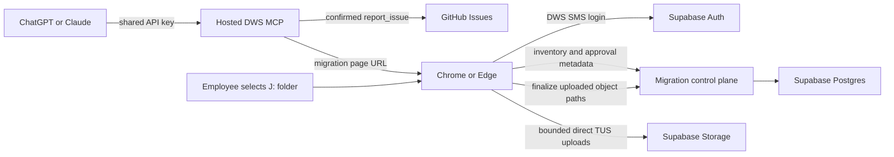
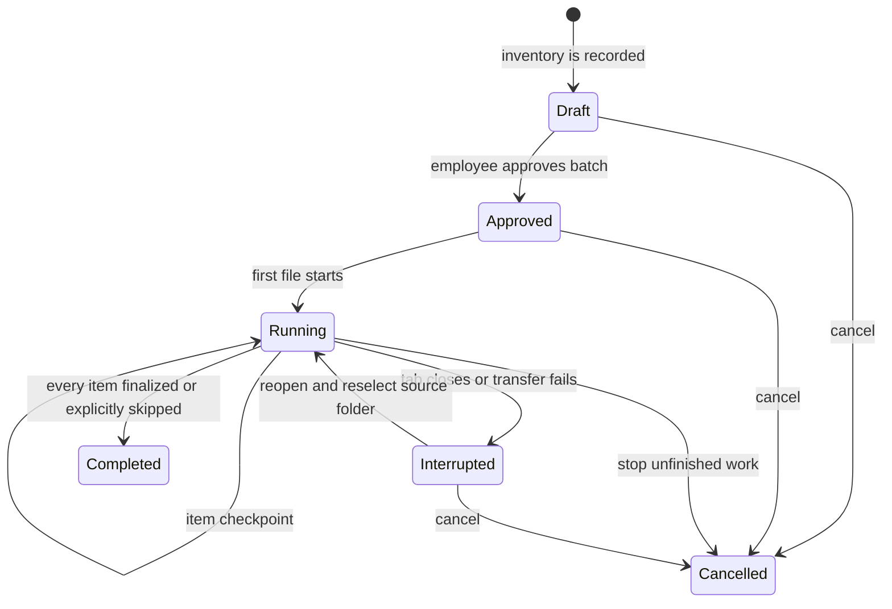
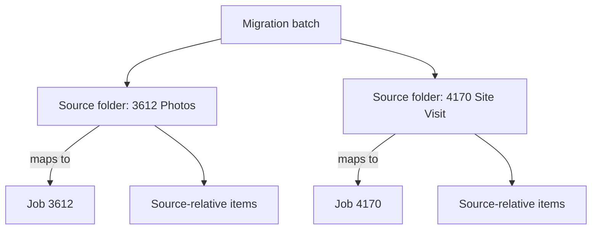
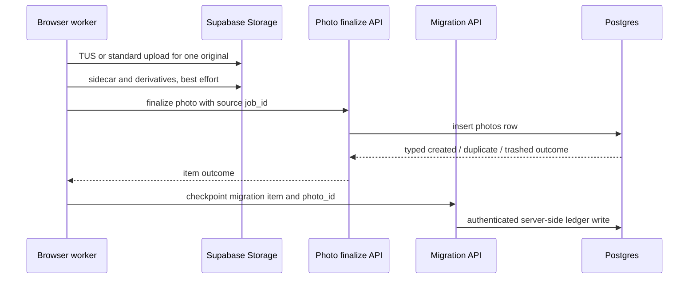
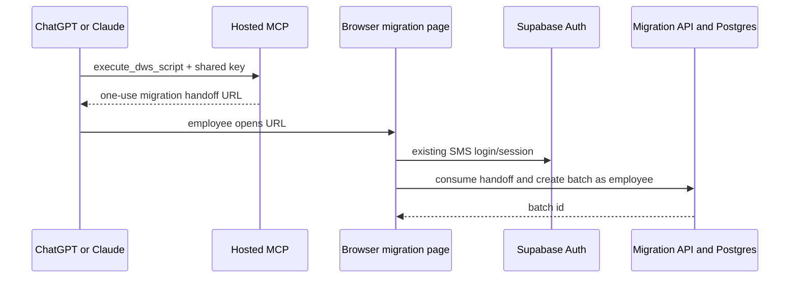

# DWS Hosted MCP, Photo Management, and Issue Reporting

### System Design

#### The hosted MCP hands local-drive work to a foreground browser migration session

Per the ticket, the MCP remains remotely accessible from ChatGPT and Claude, while photo corpora may exceed 100 GB in aggregate. The hosted server cannot read an employee's mapped `J:` drive. Instead, `migrate_photos` returns the browser migration URL. Chrome or Edge supplies user-approved access to the selected folder; file bytes then move directly from the browser to Supabase Storage rather than through MCP or a Vercel function.



The 100 GB figure is a corpus total, not one HTTP request. The browser holds file handles and small queue metadata, while TUS reads each `File` in 6 MiB chunks. Each object remains subject to the live 50 GiB bucket limit. Active transfer is foreground work: closing the tab stops it.

#### Postgres is the durable migration ledger; reselecting the folder reconstructs local access

TUS provides file-level transport recovery, while Postgres provides corpus-level recovery. The browser writes an inventory before approval and checkpoints every file as it progresses. A reopened session reads unfinished items from the server, asks the employee to reselect the source folder when browser permission is absent, and reconciles files by relative path, byte size, and last-modified time. Completed files are never scheduled again.

```sql
dws_action_handoffs
  id, token_digest, script_name, requested_input,
  expires_at, consumed_at, consumed_by,
  migration_batch_id, photo_action_batch_id, created_at

migration_batches
  id, created_by, status,
  approved_by, approved_at,
  created_at, updated_at

migration_sources
  id, batch_id, source_label, job_id,
  inventory_fingerprint,
  created_at, updated_at

migration_items
  id, batch_id, source_id, relative_path,
  source_bytes, source_last_modified, mime_type,
  content_sha256, status, uploaded_bytes, photo_id, canonical_job_id,
  lease_owner, lease_expires_at, error,
  created_at, updated_at

photo_content_claims
  content_sha256 primary key, migration_item_id,
  upload_attempt_id, lease_owner, lease_expires_at,
  created_at, updated_at

photo_action_batches
  id, action, selector_json, destination_job_id,
  created_by, approved_by, approved_at, status,
  created_at, updated_at

photo_action_items
  id, batch_id, photo_id, previous_job_id,
  status, error, created_at, updated_at

issue_report_submissions
  id, idempotency_key unique, payload_digest, dedupe_until,
  reported_by, anonymous,
  status, github_issue_number, github_issue_url,
  error, created_at, updated_at
```

Consuming a handoff binds exactly one batch foreign key and the authenticated `consumed_by` in the same transaction; unconsumed handoffs have neither binding. Broad action authority persists on that bound batch for its consumer, without making the single-use URL reusable. Content claims identify exactly one migration item or ordinary upload attempt; both upload surfaces use the same claim and lease contract.

```text
migration batch: draft | approved | running | interrupted | completed | cancelled
migration item: pending | hashing | waiting_claim | uploading | finalizing
                | retryable_failed | job_conflict | restore_required
                | completed | skipped_duplicate | skipped_missing
                | skipped_unsupported | skipped_failed | skipped_user | cancelled
photo action batch: draft | approved | running | interrupted | completed | cancelled
photo action item: pending | running | retryable_failed | conflict
                   | applied | skipped | cancelled
issue submission: pending | publishing | published | failed | unknown
```

Migration completion requires every item to be `completed` or an explicit `skipped_*` outcome. `job_conflict`, `restore_required`, and retryable errors remain unresolved until the employee resolves or skips them. Action completion similarly requires `applied` or `skipped` for every target. Cancellation marks only unfinished items `cancelled`; a cancelled batch retains its successful outcomes and cannot resume. Pause uses `interrupted`.



One approval authorizes the migration plan: the selected source folders, their destination jobs, and the media-selection rules. Before approval, the browser shows the current aggregate file count and bytes plus per-source mappings, exclusions, and warnings. Nothing uploads until the employee confirms the plan. The approval record is deliberately small: employee X approved batch Y at time Z. It does not introduce per-source approvals, a second approver, or a general event-sourcing subsystem.

Approval is an LLM-to-human safety boundary, not an immutable evidence snapshot or a human-to-human governance layer. Resuming or rescanning an approved source may update metadata for an unfinished path, add newly discovered media under the already approved source-to-job mapping, or mark a missing file `skipped_missing` without requiring another approval. A changed file is hashed and handled as its current contents. Reconciliation blocks only when the browser cannot determine the source, destination job, or canonical item safely; it does not block merely because a file's size or modification time changed.

#### Each source folder maps to one job, while a batch may span several jobs

A migration is not restricted to a single folder or job. The employee adds one or more source folders through repeated browser directory selections. Each `migration_source` records the visible folder label and one destination `job_id`; every inventoried item belongs to exactly one source. This preserves the current invariant that each finalized photo has one required job while allowing one reviewed batch to migrate several job folders.



Folder names can be used to suggest matching job numbers, but the reviewed source-to-job mapping—not the folder name—is authoritative. The `photos` skill's `migrate_photos` action accommodates both the simple one-folder case and the multi-folder case; it does not force the employee to choose the number of folders before opening the browser.

#### MCP access grants photo-wide authority rather than job-scoped permissions

The existing app permits deletion only by the uploader or an administrator (`photos_delete` and `DELETE /api/photos/:id`). Ordinary in-app deletion retains that rule. A valid MCP handoff explicitly grants its authenticated consumer broader authority for the bound photo operation, including removing other employees' photos and whole-job selections. SMS login alone does not grant that wider removal authority.

Any employee holding the MCP endpoint can obtain such a handoff, map sources to active jobs, approve uploads, and perform single or bulk move, remove, and restore actions. Routes validate the session, bound handoff, consumer, action kind, and confirmed target set before privileged mutations. Finalization retains the authenticated employee as `uploader_id`; the service-role credential stays server-side. Purge uses the existing cron credential, while human actions record the employee actor.

#### Two stable MCP tools expose two MVP skills and their actions

The MCP does not publish one protocol tool per photo operation. Its public surface remains:

```text
load_dws_skill(skill_name)
execute_dws_script(script_name, input)
```

The MVP registry contains exactly two must-ship skills: `photos` and `report_issue`. The release is not complete if issue capture is omitted or left as a future placeholder.

`load_dws_skill("photos")` teaches the model when and how to use the complete photo-management workflow. That skill advertises five unambiguously named scripts:

```text
migrate_photos   -> create a browser handoff for folder inventory and bulk upload
add_photos       -> create a browser handoff for a smaller direct upload
move_photos      -> identify existing photos and propose a destination job
remove_photos    -> identify existing photos and propose removal
restore_photos   -> identify recoverable trashed photos and propose restoration
```

`load_dws_skill("report_issue")` teaches the model to capture and normalize an app, MCP, receipt, photo, or workflow problem and exposes one unambiguous `create_github_issue` script. The generic dispatcher validates `skill_name` and `script_name` against a server-side registry rather than evaluating arbitrary code. New DWS capabilities can later extend the registry and skill instructions without adding more MCP protocol tools to every employee's client.

Photo scripts can collect structured context in the conversation, but any operation requiring local file selection or changing stored photo ownership or visibility crosses into the authenticated browser for human review and confirmation. Issue reporting is the only MVP action whose intended side effect can complete directly within the MCP conversation.

`add_photos({ job_reference?, sheet_number?, tags? })` returns the same 30-minute, single-use handoff envelope as `migrate_photos`. After SMS login, it opens file selection with the supplied metadata as editable defaults, resolves one destination job, pairs selected XMP files, and shows count and bytes before confirmation. It creates a migration batch with one file-selection source and uses the same durable item ledger, streaming hasher, global claims, direct upload, and finalize boundaries. Recovery asks the employee to reselect unfinished files. This is a compact entry into the shared pipeline, with no second upload engine or binary MCP input.

#### The report-issue skill turns conversation into one constrained GitHub write

The `report_issue` skill guides ChatGPT or Claude to turn whatever the employee knows into a useful issue without demanding fields they cannot answer. It normalizes a concise title, issue kind (`bug`, `feature`, or `question`), summary, reproduction steps when applicable, expected and actual behavior, impact, relevant job/page/context, and any links the employee supplied. It also asks for the employee's name when the conversation does not already provide one.

Reporter attribution is included by default. The final issue body contains `Reported by: <employee name>` unless the employee explicitly asks to report anonymously, in which case the name is omitted and the submission records `anonymous = true`. This is self-reported attribution rather than authenticated identity; issue reporting never requires the browser or SMS login. The assistant shows the exact final title and Markdown body, including the attribution choice, and asks for explicit confirmation before invoking `execute_dws_script("create_github_issue", ...)`.

The target repository is fixed server-side to the OpenReimbursements monorepo; the LLM cannot choose another owner or repository. The server holds a fine-grained GitHub credential with Issues read/write for that repository and the implied Metadata read permission; Contents access is unnecessary. The dispatcher allows issue creation with allowlisted labels and reads for submission reconciliation only. Although the credential can write issues, the dispatcher exposes no edit, close, code, merge, or repository-settings operations.

The server assigns a submission ID and computes a digest over the fixed repository and normalized confirmed payload, including attribution and labels. A transaction serialized by digest reuses an identical submission for 24 hours, even if the model supplies a different or missing `idempotency_key`. A supplied key is also unique; reusing it for a different payload is rejected. Concurrent identical calls converge to one record and one publishing lease. This exact-payload retry rule may coalesce independently submitted identical reports during that window; it does not compare similar issues.

A published retry returns the stored issue URL. The issue body contains the server submission ID as a hidden marker. An ambiguous GitHub timeout leaves the record `unknown`; retries reconcile that marker against recent issues and never automatically issue another create while the outcome remains uncertain. Reconciliation of an unknown submission continues even after the digest window expires. Definitive pre-publication failures are `failed` and can retry; an uncertain write requires reconciliation or operator resolution, independent of LLM key reuse.

The server rejects overlong payloads, non-allowlisted labels, and known MCP/GitHub secret values, then posts a consistently formatted issue and returns its GitHub URL. GitHub validation, authorization, or rate-limit failures retain the submission as retryable and return a useful explanation; they never claim the issue was published. The issue is authored by the configured DWS GitHub credential and labeled `source:dws-mcp`.

The MVP does not search GitHub for semantically or lexically similar issues before publishing. Its idempotency check prevents only transport retries of the same confirmed submission; it does not attempt product-level duplicate detection or block an employee from reporting a concern.

The must-ship issue payload is text-only. It may preserve ordinary HTTPS links the employee pastes, including a link to an image already hosted somewhere the team can access, but it does not accept binary data, base64 images, chat-attachment handles, or local file paths. The skill never claims to have inspected an attachment it cannot access. Native screenshot intake and attachment hosting are deferred until a future Help Desk has a separately designed browser or media handoff.

#### The must-ship report-issue skill leaves a clean seam for a future repo-aware Help Desk

The issue skill's conversational intake and structured draft are intentionally useful inputs to a later Help Desk, but the MVP does not launch coding agents or claim to diagnose the repository. A future `help_desk` skill may answer application questions, retrieve current product documentation, inspect a pinned repository revision, fan out bounded read-only codebase research, distinguish likely user error from likely defects, and recommend or draft an issue only after presenting evidence.

That future system requires its own design for agent runtime isolation, repository revision and deployment-version mapping, prompt-injection boundaries, cost and concurrency limits, timeouts, provenance, confidence language, and escalation behavior. The two-tool registry can add or evolve that skill without changing the MCP protocol surface, so deferring it does not create throwaway infrastructure in the current issue-reporting path.

#### Single-photo and bulk administration share one exact-target workflow

`move_photos`, `remove_photos`, and `restore_photos` accept either explicit photo references or a bulk selector such as all photos currently belonging to a named job. The MCP stores only the requested intent in a 30-minute handoff. After SMS login, the browser resolves that intent against current data and materializes the exact target photo IDs in `photo_action_items`; the shared MCP key alone cannot enumerate private photo data.

An explicit reference is a photo UUID supplied by the employee, an app photo link containing that UUID, or `{ job_number, original_filename }`. The browser resolves names after login and requires selection when more than one photo matches; it never guesses. A bulk selector is `{ job_number, scope: active | trash }`. Missing or ambiguous references return the employee to browser selection. The MCP returns a handoff URL, not resolved photo metadata or search results.

The review page shows the action, source scope, destination job when applicable, exact affected count, total bytes, and a paginated thumbnail list. Single-item actions use the same page with less ceremony. Confirmation freezes the target ID set so a later retry cannot silently expand from “the photos in this job when I reviewed it” to photos added afterward.

Each target executes and checkpoints independently. Replaying an already applied move, trash, or restore is a successful no-op; a photo that changed incompatibly after review becomes an item-level conflict rather than causing the remaining batch to roll back. This gives large job-wide actions resumability and an exact outcome report without introducing locks between employees.

Migration job conflicts use the same action model. When an incoming hash already belongs to another job, the item is not copied. The browser reports the owning job and can prepare an explicit `move_photos` action for the employee to confirm; migration itself never silently changes ownership. An action initiated from a migration carries that batch's validated handoff authority and consumer identity into its own confirmed target set.

#### Removed photos remain recoverable for 30 days, then purge completely

`remove_photos` and in-app Delete share soft-delete storage behavior while retaining their distinct authority checks. Both atomically set `deleted_at`, `deleted_by`, and `purge_after = deleted_at + interval '30 days'`; neither deletes Storage objects. Ordinary `DELETE /api/photos/:id` checks uploader-or-admin authority server-side. Wider removal requires the valid, consumed MCP handoff bound to the confirmed action and caller. The direct `photos_delete` RLS policy and authenticated DELETE grant are removed so clients cannot bypass either the permission check or recovery window.

The Storage bucket remains public. Trash hides photos from the library but does not revoke previously obtained public object URLs; those URLs remain fetchable during retention until the objects are purged.

```sql
alter table photos
  add column deleted_at timestamptz,
  add column deleted_by uuid references auth.users(id),
  add column purge_after timestamptz;

create index photos_trash_due_idx
  on photos (purge_after)
  where deleted_at is not null;
```

Normal reads exclude trash through explicit `deleted_at is null` predicates at every library boundary: `GET /api/photos`, photo search and counts, `get_photo_job_summaries`, `get_photo_tags`, and derivative-generation candidates in the repair sweep. Dedupe lookup is the intentional exception because trashed hashes remain reserved. The trash view uses a dedicated authenticated endpoint that returns only `deleted_at is not null and purge_after > now()`, and restoration clears all three deletion fields through the validated action boundary.

Revoke direct authenticated updates to `job_id`; ownership changes use the confirmed move boundary. Keep direct grants only for `sheet_number` and `tags`, with UPDATE RLS requiring an active row before and after mutation. `PATCH /api/photos/:id` rejects `job_id` and trash, and existing job-edit controls enter the confirmed move flow. Deletion and migration-duplicate fields receive no client update grants.

The existing daily repair function shares one 240-second work deadline across purge, bucket/row inventory, ordinary repairs, and transcodes, leaving headroom within its 300-second function limit. Purge runs first with a 500-photo cap; paginated inventory and remaining actions consume only the remaining budget. Checkpoint inventory progress so a deadline-limited partial scan can resume, and never classify orphans from an incomplete ownership snapshot. Every phase checks remaining time before starting work and bounds individual calls to the deadline; transcodes receive no independent 240-second allowance.

For each due photo, `purgeTrashedPhoto` rechecks expiry and deletion state, deletes paths from the centralized `deletionPaths()` helper only if no other retained row references them, then deletes the row after path deletions succeed. Purge and restore serialize on the same photo so a restore cannot race object removal. Backlog, deferred work, and failure counts make incomplete cleanup visible.

The orphan sweep treats every unexpired trashed row as an owner and `deleteDeadRow` ignores it. Once `purge_after` has elapsed, a partial Storage deletion may leave a row whose original is gone; a later purge retry or the existing dead-row repair action may then remove that expired row. The recovery guarantee therefore lasts the full 30 days, while post-expiry cleanup converges despite partial failures.

The global content-hash identity remains reserved while a photo is in trash. This prevents a second row from being created merely to work around the 30-day recovery lifecycle; after permanent purge, the same bytes may be added again as a new photo.

#### Each file joins the photo library as soon as it finalizes

The batch is an orchestration ledger, not an all-or-nothing transaction. After one original reaches Storage, the browser invokes the revised shared photo-finalization boundary with that item's mapped job, hash, and metadata. Every migration object uses the existing authenticated-owner convention, including `originals/${session.user.id}/...`; the employee performing the migration becomes `uploader_id`, not the historical photographer. A successful insert immediately makes the photo visible and stores its `photo_id` on the migration item. Sidecars and derivatives retain the current best-effort behavior, and the existing repair sweep converges missing derived assets.



Failures stop only the affected item. Reload and retry skip items already linked to a finalized photo. The batch becomes `completed` only when every item reaches one of the enumerated terminal outcomes; retryable failures keep it `running` or `interrupted`. There is no batch-wide commit, rollback, or delayed-visibility layer.

#### A bounded, leased pipeline survives ordinary office interruptions

The browser defaults to two concurrent TUS uploads and a small hashing look-ahead queue. This is enough to overlap local reads, server dedupe checks, and network transfer without opening hundreds of files or monopolizing office bandwidth. Queue state lives in Postgres rather than browser memory.

Before processing an item, a browser instance atomically acquires a short renewable item lease. Another tab or laptop cannot upload that item while the lease is current; an expired lease becomes resumable after a crash or closed tab. After hashing, a server transaction first checks active and trashed photos, then inserts the digest into `photo_content_claims`, whose primary key makes the claim global and atomic across batches. A live claim held by another item reports the owning active batch and waits rather than transferring duplicate bytes.

The content claim has its own renewable expiry. Successful finalization inserts the globally unique photo row and deletes the claim in one database transaction. Explicit skip, cancellation, or a permanent pre-upload failure releases it immediately; abandonment or a crashed browser makes it reclaimable after expiry. The global photo constraint remains authoritative if a claim expires during a slow or partitioned upload.

Transient network and rate-limit failures retry with exponential backoff and jitter. Authentication, authorization, storage-quota, unsupported-file, and over-50-GiB failures stop or skip immediately with a specific remedy rather than consuming the generic retry budget. Going offline, pressing Pause, or closing the tab stops new work without changing finalized items. Cancel stops the remaining queue and leaves already finalized photos in the library.

The authenticated `/migrate` page lists active and recent batches for shared inspection. The bound handoff consumer can resume or cancel without a new MCP URL, then reselect local source folders when needed. Read access to another employee's batch does not grant its broader mutation authority; another MCP holder can initiate their own confirmed action.

#### Inventory admits media and paired XMP while reporting Picasa internals as exclusions

The browser recursively inventories each selected source folder using the existing extension-first photo classification. Supported images and videos become migration items. An `.xmp` file pairs with an image of the same basename in the same source-relative directory and is represented as that item’s sidecar rather than as a separate photo.

Picasa-specific control data and caches are not migration payloads. `.picasa.ini`, `.picasaoriginals`, thumbnails, databases, hidden/system files, and unknown non-media files are recorded only in exclusion counts and warnings. They are neither uploaded as generic file tiles nor interpreted into captions, faces, albums, stars, or edit recipes.

```text
Selected source
  supported image/video       -> migration item
  matching basename.xmp       -> item sidecar
  unmatched .xmp              -> warning + excluded
  .picasa.ini                 -> excluded: picasa-internal
  .picasaoriginals/**         -> excluded: picasa-internal
  hidden/cache/unknown file   -> excluded with reason
```

The pre-approval review shows included media count and bytes, paired/unmatched XMP counts, and exclusions grouped by reason so the employee can inspect the plan without uploading Picasa internals.

Inventories do not travel as one Vercel request. The browser writes idempotent chunks of at most 500 items and at most 1 MiB of JSON through the migration API, keyed by source, scan ID, and chunk number. A final seal request records expected counts, bytes, exclusions, and the source fingerprint; approval is unavailable until the server verifies that every chunk is present. This stays below Vercel's request-body limit even when the source contains hundreds of thousands of files, while keeping all manifest mutations behind authenticated application routes.

#### Duplicate prevention gets progressively stronger without delaying the first upload

The migration uses three idempotency layers rather than choosing between a metadata-only scan and hashing the entire corpus up front.

```text
1. Inventory fingerprint — no file contents read
   sorted(relative_path, bytes, last_modified) + destination job
   -> identical completed source: block as already migrated
   -> identical interrupted source: direct employee to resume it

2. Just-in-time SHA-256 — incremental worker, bounded look-ahead
   hash the next few files while the current file uploads
   -> server atomically claims sha256 before upload
   -> existing/claimed content: mark duplicate without transferring bytes

3. Final database constraint — authoritative race protection
   photos(content_sha256) unique where hash is not null
   -> concurrent/replayed finalize converges to one photo
```

The source fingerprint is a fast idempotency hint built from the current inventory, not proof that two files have identical bytes and not an approval seal. It catches the common whole-folder retry before upload. If a previously migrated folder has gained or changed files, its fingerprint changes; item-level signatures identify already finalized entries and leave only additions or changes to process.

Content hashing is not an hours-long approval prerequisite. A browser Web Worker incrementally hashes fixed-size slices with bounded memory immediately ahead of the upload queue. WebCrypto cannot stream a digest, so this requires a new worker-safe incremental SHA-256 JS/WASM dependency rather than reconfiguring the existing full-buffer helper. The dependency choice and chunk interface are settled in Program Design. Hashing and uploading overlap, so local disk work is pipelined behind slower internet transfer.

#### Global photo identity applies to migration and the existing upload sheet

A photo belongs to exactly one job across the whole library. Preflight is dry-run by default: it reports every repeated non-null hash, affected photo IDs and jobs, and the proposed changes without writing. An administrator chooses the canonical row and owning job for each group, then explicitly executes the reviewed mapping. Every noncanonical row enters the ordinary 30-day trash lifecycle, preserving its metadata and object paths. No canonical choice or data cleanup runs automatically on deployment.

Trashing alone cannot satisfy a global index that also reserves trashed hashes. The cleanup therefore archives each noncanonical row's digest as `legacy_content_sha256`, records `duplicate_of` as the canonical photo ID, and clears only that row's indexed `content_sha256`. The canonical row retains the global digest. Legacy duplicate rows remain recoverable in trash, but restoration resolves to the canonical photo: the employee confirms restore or move of that photo rather than recreating two active rows for the same bytes. The trash UI explains this distinction and preserves the old metadata during retention. A canonical row referenced by an unexpired duplicate cannot purge until that duplicate's retention has ended.

```sql
photos (additional migration-only provenance)
  legacy_content_sha256, duplicate_of references photos(id)
  -- duplicate_of rows must stay trashed and have content_sha256 = null
```

Cutover pauses photo writes, revalidates the administrator's choices against current rows, applies the cleanup, and replaces `photos_job_sha` with a global partial unique index on `photos(content_sha256) where content_sha256 is not null` before reopening writes with the updated application. Existing null-hash rows remain a documented legacy coverage gap; they are not proof of unique bytes. Production duplicate counts are unknown until the dry run executes.

The everyday upload sheet and migration pipeline both adopt the streaming worker hasher for every supported file size, removing the sheet's 100 MB hashing cutoff. Hash failure blocks finalization rather than silently inserting a new null hash; new writes require a digest. Both surfaces use the shared global claim and lookup contract. The current `exists(jobId, digest)` preflight becomes a digest-only lookup that returns the canonical `photo_id`, owning `job_id`, trash state, and `purge_after`. The finalize API recognizes the new global constraint and always returns one of these typed outcomes:

```text
created             -> photo_id, job_id
duplicate_active    -> canonical photo_id, owning job_id
duplicate_trashed   -> canonical photo_id, owning job_id, purge_after
```

The unique constraint remains the race-safe authority. If it wins after bytes were uploaded, finalize re-queries the canonical row, returns the same typed duplicate outcome, and best-effort removes the now-unreferenced new objects; the orphan sweep is the fallback. No upload surface exposes a generic HTTP 500 for this business outcome.

For either upload surface, a same-job active match skips as `skipped_duplicate`; a different-job active match reports `job_conflict` and offers the separately confirmed move action. A trashed match becomes `restore_required`: offer restore for the same job or restore-and-move for a different job, through the confirmed action boundary with actor attribution. Once resolved, the migration item records the canonical photo as `skipped_duplicate`; explicit refusal can become `skipped_user`. The item records canonical `photo_id` and `canonical_job_id` in every non-created outcome, and no duplicate transfers bytes after successful preflight.

#### A shared key gates MCP discovery; Supabase login owns every migration write

For the MVP, every MCP request reaches an endpoint containing one rotatable DWS-wide 256-bit key:

```text
https://<mcp-host>/mcp/<shared-key>
```

The server compares the opaque path segment with `DWS_MCP_SHARED_KEY` on every request. The key protects skill text, photo-action launchers, and issue submission, but it is not an employee identity. Photo scripts create a single-use handoff expiring 30 minutes after creation and return its browser URL. The shared key never appears in that browser URL or in migration records. The token is consumed only after successful SMS session validation; an expired or already consumed token shows a non-sensitive explanation and directs the employee to run the script again.

The browser then establishes the employee identity through the app's existing Supabase SMS session. It atomically consumes the handoff and binds it to the requested action record, creating a migration batch when applicable. `created_by` and `approved_by` therefore contain real Supabase user IDs rather than a synthetic shared-key principal. SMS is an attribution step, not a role gate: every authenticated holder of a valid handoff has the same photo-management authority.

Every new table enables RLS. `dws_action_handoffs`, `photo_content_claims`, and `issue_report_submissions` have no client policy and are accessible only to server-side service-role code. Migration and photo-action batch/item tables grant authenticated employees read access for shared operational visibility but no direct mutation access. Application routes validate the request-cookie session and bound authority, execute narrow mutations with the service role, and record the employee ID. Supabase Storage uploads remain the exception: the browser writes directly as the authenticated employee under that employee's UID-prefixed path, using existing Storage RLS.

Route and database-policy integration tests enforce this boundary: anonymous and authenticated clients cannot read or mutate the three server-only tables, mutate ledgers, directly delete photos, or update `job_id` or trash metadata. Route tests cover expired/replayed handoffs, wrong consumers/action kinds, uploader-or-admin ordinary deletion, wider deletion only through bound MCP authority, and PATCH rejection of trash. Read-filter tests seed active and trashed photos and exercise library listing, search/counts, both summary/tag RPCs, and repair candidates. Purge tests cover partial deletion, shared paths, retention expiry, restore races, and the shared cron deadline.



The client configures this endpoint without an OAuth handshake. ChatGPT's Developer Mode guide documents Streamable HTTP MCP and a No Authentication option ([OpenAI documentation](https://developers.openai.com/api/docs/guides/developer-mode)); Anthropic explicitly lists authless remote MCP servers as supported ([connector authentication](https://claude.com/docs/connectors/building/authentication), checked 2026-09-04). This supports the chosen connector mode; the exact secret-bearing URL still requires an end-to-end connection test in both products before release.

The shared key is a temporary coarse gate: rotating it invalidates every configured connector and requires employees to paste the replacement URL. Hosting and provider logs may capture request paths; Anthropic also discourages URL credentials. The accepted MVP keeps this limitation explicit and exposes no employee photo data through MCP. Its only direct external mutation is a confirmed issue submission; browser login remains mandatory for all photo state.

OAuth is a later replacement for the MCP request gate, not a photo-management or migration-data redesign. The browser session, server-backed manifests, and action confirmation boundaries remain unchanged.

#### MCP, migration, and issue-reporting APIs deploy with the existing Next.js application

The MVP adds the MCP endpoint and browser migration routes to the existing Vercel Hobby deployment of `dws-app`; the research's live inspection names that project `dws-receipts`. Revalidate the project identity before deployment. It does not create another service or runtime. The owner has classified this as an internal, non-commercial tool for the MVP. The MCP tools and GitHub issue posts are short control-plane requests. Photo bytes continue to bypass Vercel entirely.

```text
Vercel project: dws-receipts (application directory: dws-app)
  mcp.dws-receipts.com/mcp/<shared-key> -> Streamable HTTP MCP route
  photos.dws-receipts.com/migrate       -> browser migration UI
  /api/photo-migrations/*               -> manifest and approval APIs
  GitHub REST API                        -> fixed-repository issue creation

Supabase Pro
  Postgres                               -> batches, items, photos
  Storage                                -> direct TUS originals and derivatives
  Auth                                   -> employee SMS identity
```

The MCP and browser app share one repository, release, environment, Supabase client layer, and Vercel observability. OAuth can later replace the path key inside the same endpoint without moving the migration or issue-reporting APIs.

### Program Design

The user moved directly to native plan authoring on 2026-09-04. The implementation contract is now `plans/active/dws-hosted-mcp/plan.md`; its detailed contracts and phases supersede this unfinished Program Design section. No additional design-review round was performed.

### What We're Not Doing

- The MVP will not introduce a second Vercel project, a Supabase Edge Function, or another independently deployed service.
- The MVP issue workflow will not launch coding agents, search or clone the repository, answer product-support questions from source code, classify user error versus code defects, or modify code. Those capabilities belong to a separately designed repo-aware Help Desk evolution.
- The MVP issue workflow will not ingest or upload screenshots, chat attachments, or other binary files; employees may include already-hosted HTTPS links.
- The MVP issue workflow will not search for or suppress similar existing GitHub issues; it prevents only duplicate posts caused by retrying the same submission.

### Patterns to Follow

- `dws-app/src/lib/supabaseServerClient.ts` — derive browser-handoff identity from the existing request cookie rather than from MCP credentials.
- `dws-app/src/app/api/auth/send-otp/route.ts` and `verify-otp/route.ts` — reuse the existing SMS sign-in boundary.
